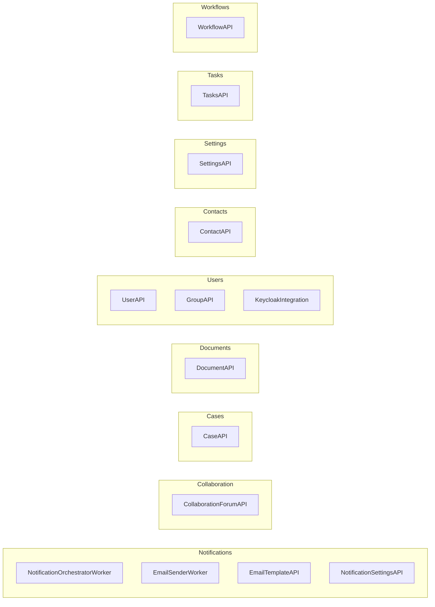

This is just the beginning of this diagram. The goal is to build a context map (DDD) that gives the high level overview of all bounded contexts in the system

```mermaid
flowchart LR
subgraph Notifications
    NotificationOrchestratorWorker
    EmailSenderWorker
    EmailTemplateAPI
    NotificationSettingsAPI
end

subgraph Collaboration
    CollaborationForumAPI
end

subgraph Cases
    CaseAPI
end

subgraph Documents
    DocumentAPI
end

subgraph Users
    UserAPI
    GroupAPI
    KeycloakIntegration
end

subgraph Contacts
    ContactAPI
end

subgraph Settings
    SettingsAPI
end

subgraph Tasks
    TasksAPI
end

subgraph Workflows
    WorkflowAPI
end
```