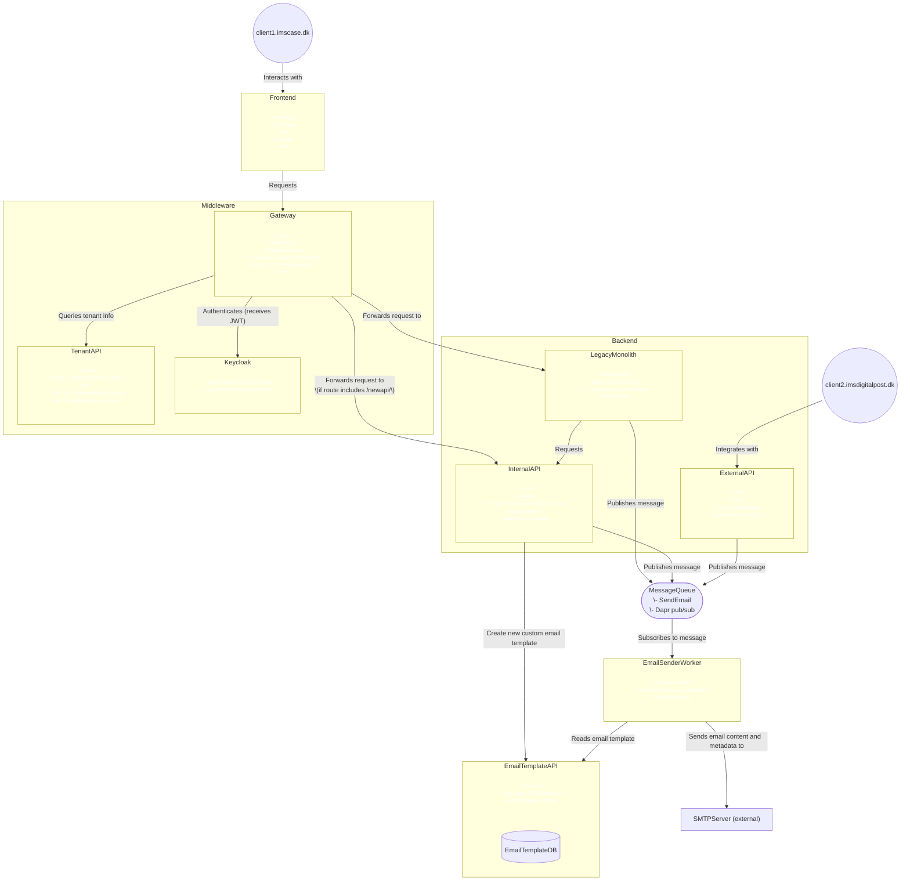

```mermaid
flowchart TB

    %% Styling
    classDef description stroke-width:0px, color:#fff, fill:transparent, font-size:12px

    %% Components
    Client1((client1.imscase.dk))
    
    subgraph Frontend
        FrontendDescription["\- WebApp <br> \- TypeScript <br> \- Vue3 <br> \- Vuetify <br>\- Pinia"]:::description
    end

    subgraph Middleware
        subgraph Keycloak
            KeycloakDescription["\- Open source Identity Provider <br> \- Each tenant has its own realm"]:::description
        end
        subgraph TenantAPI
            TenantAPIDescription["\- C# API <br> \- Wraps a database holding tenant info <br> \- Tells the Gateway which Keycloak realm to authenticate up against"]:::description
        end
        subgraph Gateway
            GatewayDescription["\- C# API <br> \- Authenticates <br> \- Identifies tenant <br> \- Forwards request with tenantId and JWT (is tenantId baked into JWT?)"]:::description
        end
    end
    
    subgraph Backend
        subgraph ExternalAPI
            ExternalAPIDescription["\- C# API <br> \- Public <br> \- Authorizes requests <br> \- Only for basic use cases"]:::description
        end
        subgraph InternalAPI
            InternalAPIDescription["\- C# API <br> \- Private <br> \- Only reachable from Gateway and LegacyMonolith <br> \- Authorizes requests <br>"]:::description
        end
        subgraph LegacyMonolith
            LegacyMonolithDescription["\- Java monolith <br> \- Built on Alfresco ECM <br> \- Will be gradually outphased for microservices"]:::description
        end
    end

    Client2((client2.imsdigitalpost.dk))

    MessageQueueSendEmail(["MessageQueue <br>\- SendEmail<br> \- Dapr pub/sub"])
    
    subgraph EmailSenderWorker
        EmailSenderWorkerDescription["\- C# ServiceWorker <br>\- Dynamically populates templates with FluentEmail"]:::description
    end


    subgraph EmailTemplateAPI
        EmailTemplateAPIDescription["\- C# API <br> \- Lets users CRUD their own custom email templates"]:::description
        EmailTemplateDB@{ shape: cyl, label: "EmailTemplateDB" }
    end
    
    %% Relationships
    Client1 -->|Interacts with| Frontend
    Frontend -->|Requests| Gateway
    Gateway -->|"Authenticates (receives JWT)"| Keycloak
    Gateway -->|Queries tenant info| TenantAPI
    
    Gateway -->|"Forwards request to <br> \(if route includes /newapi/\)"| InternalAPI
    Gateway -->|Forwards request to| LegacyMonolith

    Client2 -->|Integrates with| ExternalAPI

    LegacyMonolith -->|Requests| InternalAPI
    LegacyMonolith -->|Publishes message| MessageQueueSendEmail

    InternalAPI -->|Publishes message| MessageQueueSendEmail

    InternalAPI -->|"Create new custom email template"| EmailTemplateAPI

    EmailSenderWorker -->|Reads email template| EmailTemplateAPI

    ExternalAPI -->|Publishes message| MessageQueueSendEmail

    MessageQueueSendEmail -->|Subscribes to message| EmailSenderWorker

    EmailSenderWorker -->|Sends email content and  metadata to| SMTPServer["SMTPServer (external)"]
```