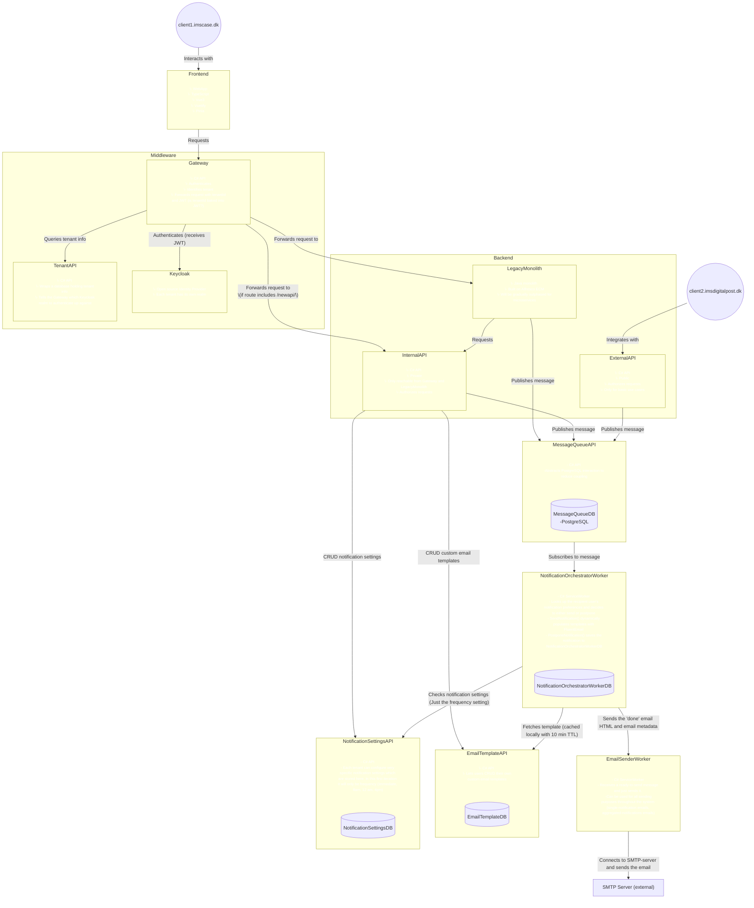

```mermaid
flowchart TB

    %% Styling
    classDef description stroke-width:0px, color:#fff, fill:transparent, font-size:12px

    %% Components
    Client1((client1.imscase.dk))
    
    subgraph Frontend
        FrontendDescription["\- WebApp <br> \- TypeScript <br> \- Vue3 <br> \- Vuetify <br>\- Pinia"]:::description
    end

    subgraph Middleware
        subgraph Keycloak
            KeycloakDescription["\- Open source Identity Provider <br> \- Each tenant has its own realm"]:::description
        end
        subgraph TenantAPI
            TenantAPIDescription["\- C# API <br> \- Wraps a database holding tenant info <br> \- Tells the Gateway which Keycloak realm to authenticate up against"]:::description
        end
        subgraph Gateway
            GatewayDescription["\- C# API <br> \- Authenticates <br> \- Identifies tenant <br> \- Forwards request with tenantId and JWT (is tenantId baked into JWT?)"]:::description
        end
    end
    
    subgraph Backend
        subgraph ExternalAPI
            ExternalAPIDescription["\- C# API <br> \- Public <br> \- Authorizes requests <br> \- Only for basic use cases"]:::description
        end
        subgraph InternalAPI
            InternalAPIDescription["\- C# API <br> \- Private <br> \- Only reachable from Gateway and LegacyMonolith <br> \- Authorizes requests <br>"]:::description
        end
        subgraph LegacyMonolith
            LegacyMonolithDescription["\- Java monolith <br> \- Built on Alfresco ECM <br> \- Will be gradually outphased for microservices"]:::description
        end
    end

    Client2((client2.imsdigitalpost.dk))

    subgraph MessageQueueAPI
        MessageQueueAPIDescription["<br>- C# API <br>-Abstracts PostgreSQL interaction to reduce coupling"]:::description
        MessageQueueDB@{ shape: cyl, label: "MessageQueueDB \n -PostgreSQL"}
    end

    
    subgraph NotificationOrchestratorWorker
        NotificationOrchestratorWorkerDescription["<br>- C# ServiceWorker <br>- Looks up the recipient user's notification preferences and decides to either send or postpone <br>- SendNotification() dynamically populates templates with FluentEmail <br>- PostponeNotification() saves the notification to NotificationOrchestratorWorkerDB"]:::description
        NotificationOrchestratorWorkerDB@{ shape: cyl, label: "NotificationOrchestratorWorkerDB"}
    end

    subgraph EmailSenderWorker
        EmailSenderWorkerDescription["<br>- C# ServiceWorker <br>- Receives a ready-to-send message and just sends it. <br> -Can be used for all sending purposes throughout the system (single-notification emails, aggregated-notifications emails)"]:::description
    end

    subgraph EmailTemplateAPI
        EmailTemplateAPIDescription["\- C# API <br> \- Lets users CRUD their own custom email templates"]:::description
        EmailTemplateDB@{ shape: cyl, label: "EmailTemplateDB" }
    end

    subgraph NotificationSettingsAPI
        NotificationSettingsAPIDescription["<br>- C# API <br>- Each tenant can configure very specific notification settings which are stored here. In this first iteration it will only be frequency (Immediate, 8am, 12 am, 4pm)"]:::description
        NotificationSettingsDB@{ shape: cyl, label: "NotificationSettingsDB" }
    end
    
    %% Relationships
    Client1 -->|Interacts with| Frontend
    Frontend -->|Requests| Gateway
    Gateway -->|"Authenticates (receives JWT)"| Keycloak
    Gateway -->|Queries tenant info| TenantAPI
    
    Gateway -->|"Forwards request to <br> \(if route includes /newapi/\)"| InternalAPI
    Gateway -->|Forwards request to| LegacyMonolith

    Client2 -->|Integrates with| ExternalAPI

    LegacyMonolith -->|Requests| InternalAPI
    LegacyMonolith -->|Publishes message| MessageQueueAPI

    InternalAPI -->|Publishes message| MessageQueueAPI

    InternalAPI -->|"CRUD custom email templates"| EmailTemplateAPI

    InternalAPI -->|"CRUD notification settings"| NotificationSettingsAPI

    ExternalAPI -->|Publishes message| MessageQueueAPI

    MessageQueueAPI -->|Subscribes to message|NotificationOrchestratorWorker

    NotificationOrchestratorWorker -->|"Checks notification settings (Just the frequency setting)"|NotificationSettingsAPI

    NotificationOrchestratorWorker -->|"Fetches template (cached locally with 10 min TTL)"|EmailTemplateAPI

    NotificationOrchestratorWorker -->|"Sends the 'done' email HTML and email metadata"|EmailSenderWorker
    
    EmailSenderWorker -->|"Connects to SMTP-server and sends the email"|SMTPServer["SMTP Server (external)"]
```