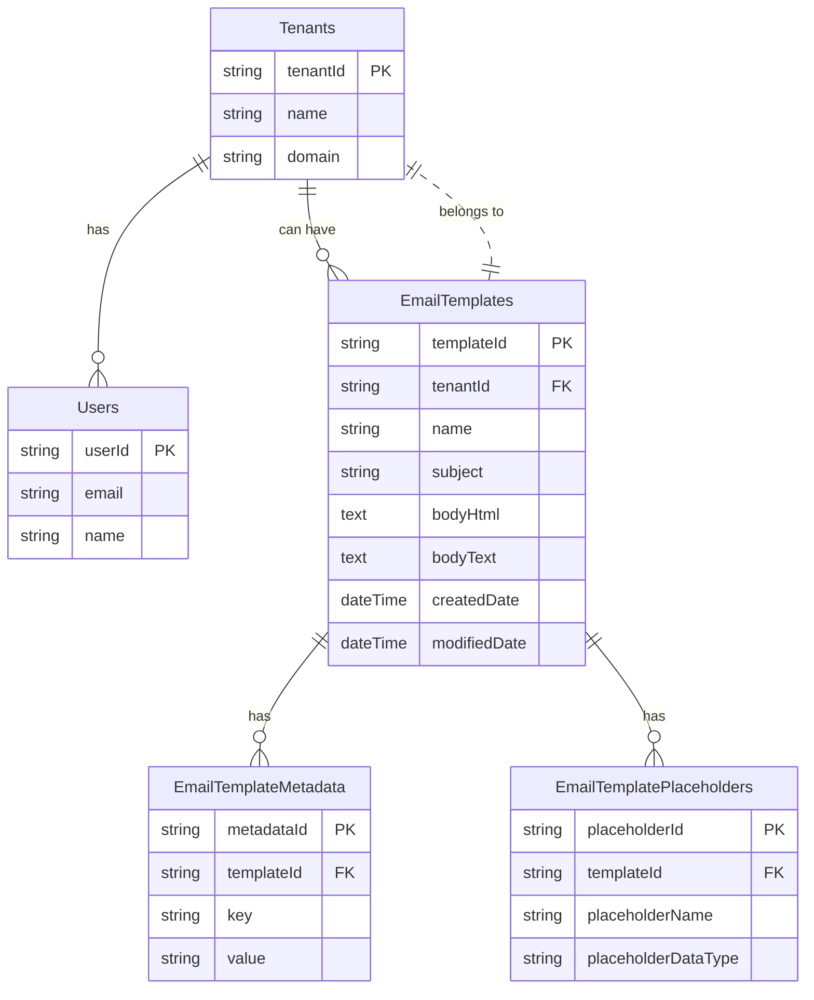

```mermaid

erDiagram

    Users {
        string userId PK
        string email
        string name
    }

    Tenants {
        string tenantId PK
        string name
        string domain
    }

    EmailTemplates {
        string templateId PK
        string tenantId FK
        string name
        string subject
        text bodyHtml
        text bodyText
        dateTime createdDate
        dateTime modifiedDate
    }

    EmailTemplateMetadata {
        string metadataId PK
        string templateId FK
        string key
        string value
    }

    EmailTemplatePlaceholders {
        string placeholderId PK
        string templateId FK
        string placeholderName
        string placeholderDataType
    }

    Tenants ||--o{ Users: "has"
    Tenants ||--o{ EmailTemplates: "can have"
    EmailTemplates ||--o{ EmailTemplateMetadata: "has"
    EmailTemplates ||--o{ EmailTemplatePlaceholders: "has"
    EmailTemplates ||..|| Tenants: "belongs to"
```