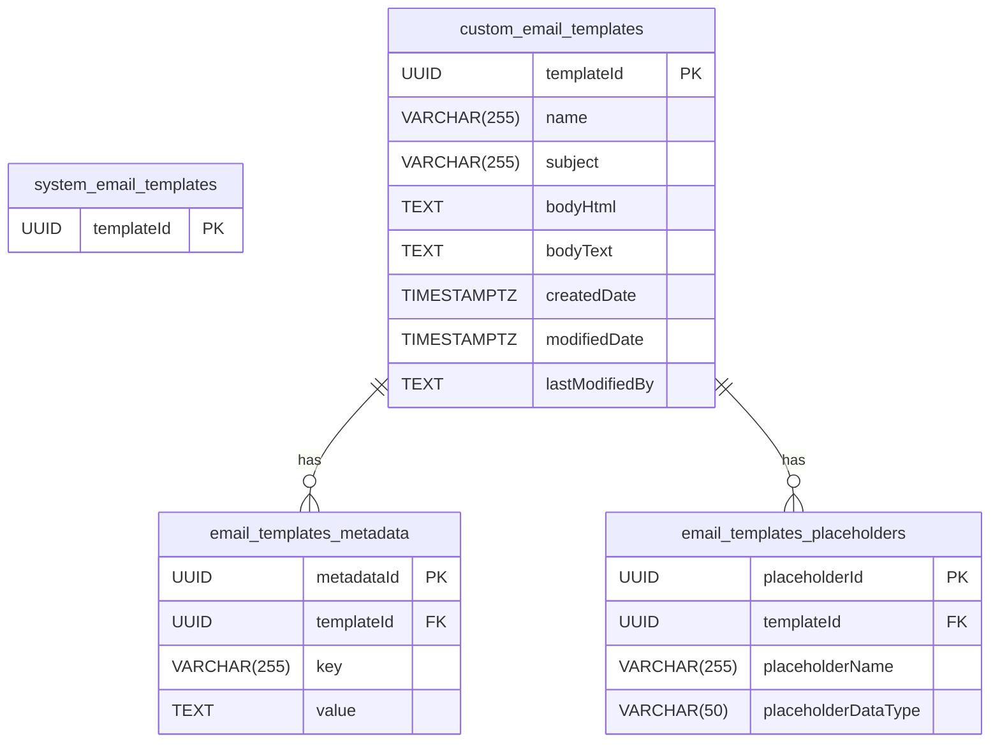
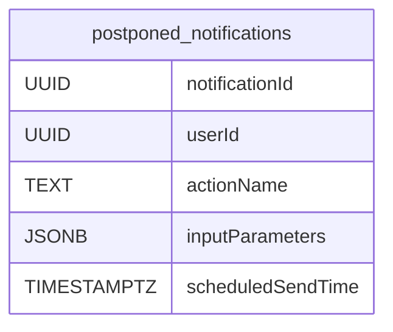
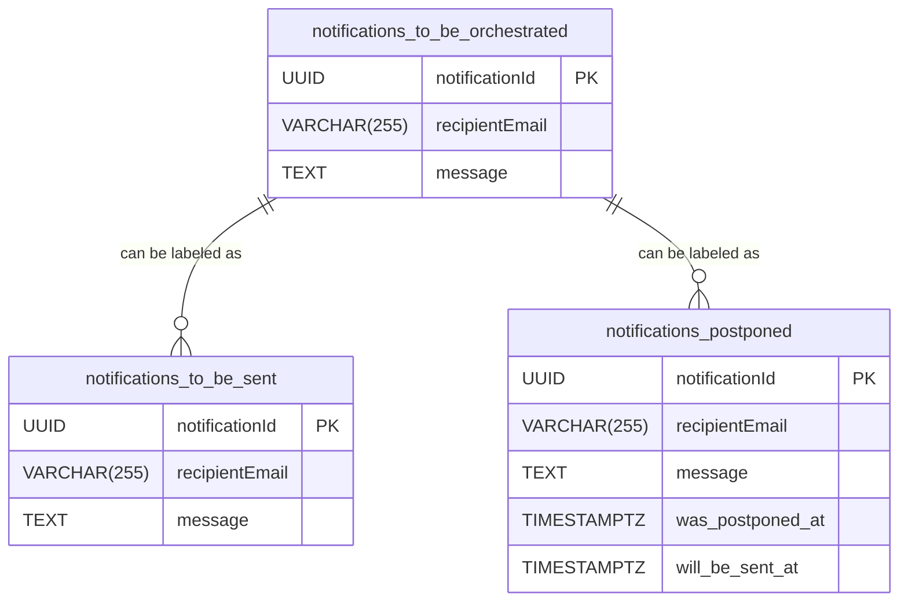
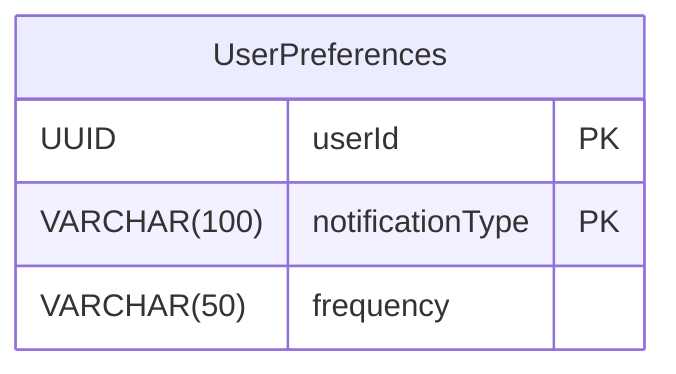

# ER Diagrams

## EmailTemplateDB
- Schema per tenant
- The current implementation of custom email templates has several properties that I don't fully understand:
    - category, language, active

## NotificationOrchestratorWorkerDB
- Every email stored in this table will be sent as part of a batch job, where the user will receive an aggregated notification summary (i.e. every weekday at 08:00 AM).
- We don't need to store a templateId, because the same template will be used for these emails always.

## MessageQueueDB

## NotificationSettingsDB
