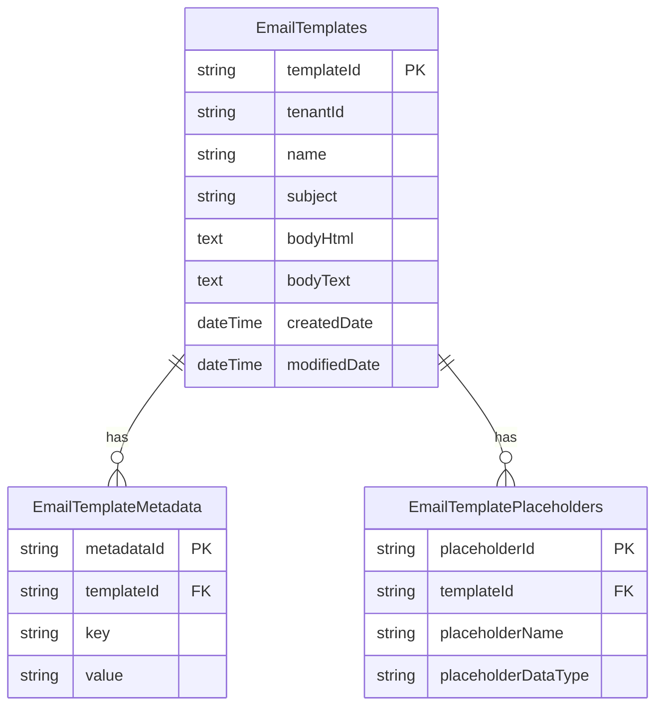
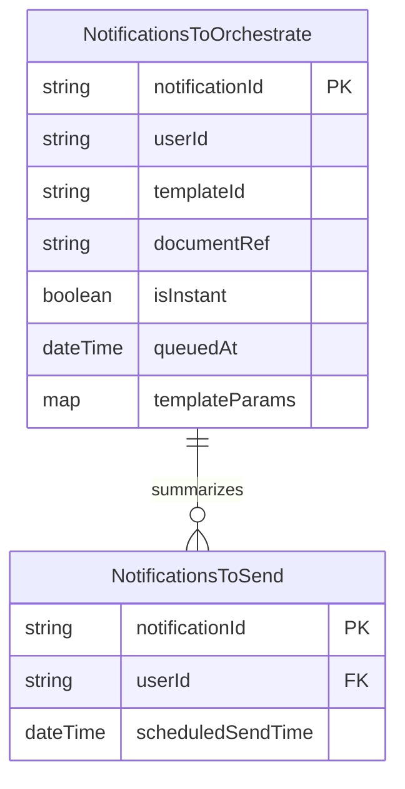
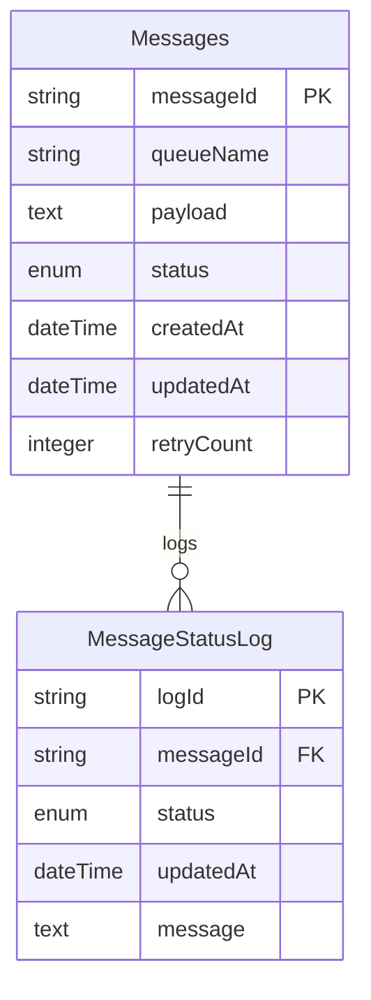
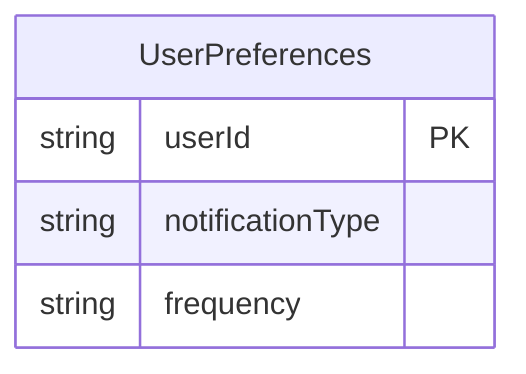

# ER Diagrams

## EmailTemplateDB

```mermaid
erDiagram

    EmailTemplates {
        string templateId PK
        string tenantId
        string name
        string subject
        text bodyHtml
        text bodyText
        dateTime createdDate
        dateTime modifiedDate
    }

    EmailTemplateMetadata {
        string metadataId PK
        string templateId FK
        string key
        string value
    }

    EmailTemplatePlaceholders {
        string placeholderId PK
        string templateId FK
        string placeholderName
        string placeholderDataType
    }

    EmailTemplates ||--o{ EmailTemplateMetadata: "has"
    EmailTemplates ||--o{ EmailTemplatePlaceholders: "has"
```

## NotificationOrchestratorWorkerDB

```mermaid
erDiagram

    NotificationsToOrchestrate {
        string notificationId PK
        string userId
        string templateId
        string documentRef
        boolean isInstant
        dateTime queuedAt
        map templateParams
    }

    NotificationsToSend {
        string notificationId PK
        string userId FK
        dateTime scheduledSendTime
    }
    
    NotificationsToOrchestrate ||--o{ NotificationsToSend: "summarizes"
```

## MessageQueueDB

```mermaid
erDiagram

    Messages {
        string messageId PK
        string queueName
        text payload
        enum status
        dateTime createdAt
        dateTime updatedAt
        integer retryCount
    }

    MessageStatusLog {
        string logId PK
        string messageId FK
        enum status
        dateTime updatedAt
        text message
    }

    Messages ||--o{ MessageStatusLog: "logs"
```

## NotificationSettingsDB

```mermaid
erDiagram

    UserPreferences {
        string userId PK
        string notificationType
        string frequency
    }
```