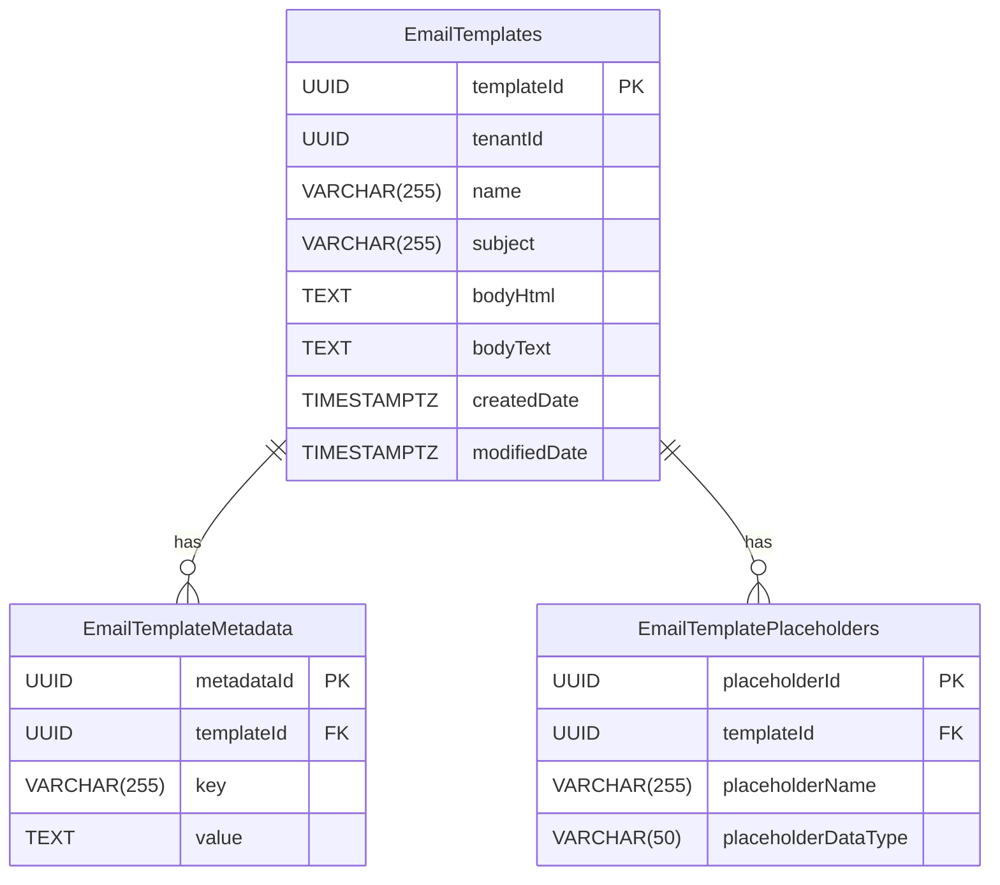
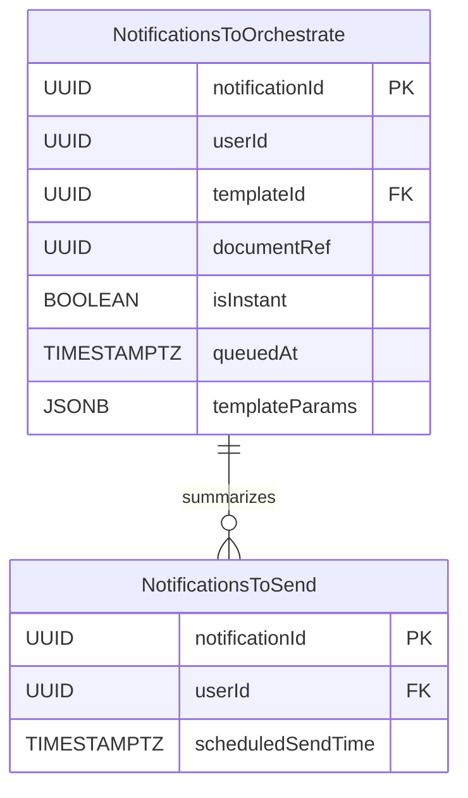
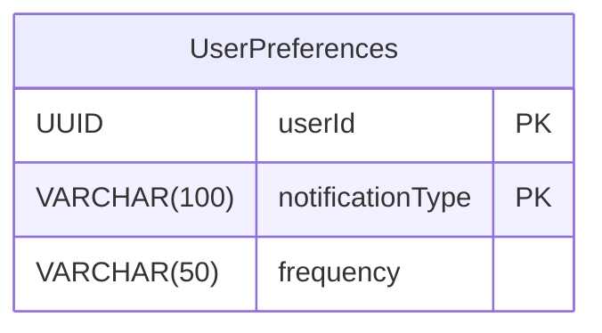

# ER Diagrams

## EmailTemplateDB


## NotificationOrchestratorWorkerDB


## MessageQueueDB
```mermaid
erDiagram

    NotificationsToBeOrchestrated {
        UUID notificationId PK
        UUID userId
        UUID templateId
        JSONB templateParams
        TIMESTAMPTZ createdAt
        TEXT status      // Status of the message, e.g., 'NEW', 'PROCESSED'
    }

    NotificationsToBeSent {
        UUID notificationId PK
        UUID userId
        UUID templateId
        JSONB templateParams
        TIMESTAMPTZ scheduledSendTime
        TIMESTAMPTZ createdAt
    }

    NotificationsPostponed {
        UUID notificationId PK
        UUID userId
        UUID templateId
        JSONB templateParams
        TIMESTAMPTZ postponementPeriod
        TEXT aggregatedDetails  // Potentially hold info about summaries
        TIMESTAMPTZ createdAt
    }

    NotificationsToBeOrchestrated ||--o{ NotificationsToBeSent: "triggers"    
    NotificationsToBeOrchestrated ||--o{ NotificationsPostponed: "results in"
```

## NotificationSettingsDB
