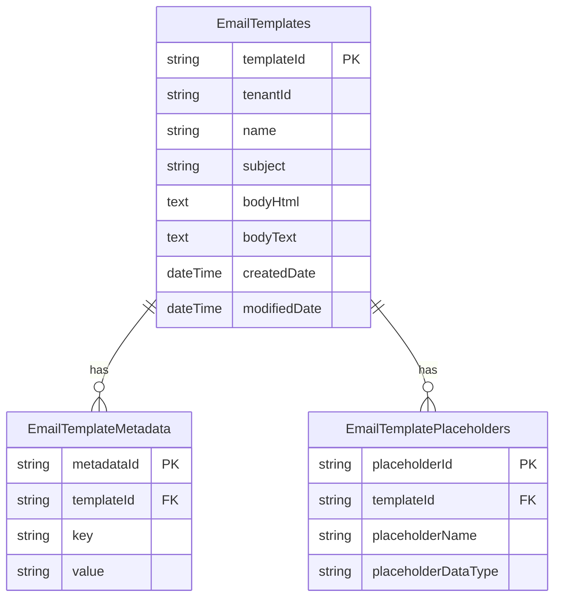

```mermaid

erDiagram

    EmailTemplates {
        string templateId PK
        string tenantId
        string name
        string subject
        text bodyHtml
        text bodyText
        dateTime createdDate
        dateTime modifiedDate
    }

    EmailTemplateMetadata {
        string metadataId PK
        string templateId FK
        string key
        string value
    }

    EmailTemplatePlaceholders {
        string placeholderId PK
        string templateId FK
        string placeholderName
        string placeholderDataType
    }

    EmailTemplates ||--o{ EmailTemplateMetadata: "has"
    EmailTemplates ||--o{ EmailTemplatePlaceholders: "has"
```