```mermaid
flowchart LR

    %% Styling
    classDef description stroke-width:0px, color:#fff, fill:transparent, font-size:12px

    %% Components
    Client1((client1.imscase.dk))

    subgraph Frontend
        FrontendDescription["\- WebApp <br> \- TypeScript <br> \- Vue3 <br> \- Vuetify <br>\- Pinia"]:::description
    end

    subgraph LegacyMonolith1
        LegacyMonolith1Description["\- Java monolith <br> \- Built on Alfresco ECM <br> \- Will be gradually outphased for microservices"]:::description
    end
    subgraph LegacyMonolith2
        LegacyMonolith2Description["\- Java monolith <br> \- Built on Alfresco ECM <br> \- Will be gradually outphased for microservices"]:::description
    end

    Client2((client2.imsdigitalpost.dk))

    subgraph NotificationService

        subgraph EmailSenderAPI
            EmailSenderAPIDescription["<br>- C# API (dapr) <br>- Subscribes to EmailTemplatePopulated event"]:::description
        end

            subgraph EmailTemplateAPI
                EmailTemplateAPIDescription["<br>- C# API (dapr) <br>- Lets users CRUD their custom email templates <br>- Subsribes to PopulateEmailTemplate event <br>- (Maybe: Lets users preview what the final email will look like) <br>"]:::description

                EmailTemplateDB@{ shape: cyl, label: "EmailTemplateDB \n -PostgreSQL" }
            end


        subgraph NotificationAPI
            NotificationAPIDescription["<br>- C# API (dapr) <br>- Lets users CRUD notification settings <br>- Stores notifications for all users across all tenants <br>- Subscribes to NotificationInitialized event"]:::description
            NotificationDB@{ shape: cyl, label: "NotificationDB \n -PostgreSQL" }
        end
    end

    %% Relationships
    Client1 -->|Uploads document to a case| Frontend

    Frontend -->|Uploads document to a case| LegacyMonolith1

    Client2 -->|"Integrates with <br> (Uploads document to a case)"| LegacyMonolith2

    LegacyMonolith1 -->|Notify case owner about the upload| NotificationAPI

    LegacyMonolith2 -->|Notify case owner about the upload| NotificationAPI

    NotificationAPI-->|Publishes event PopulateEmailTemplate|EmailTemplateAPI
    
    NotificationAPI-->|"POST api/notification"|LegacyMonolithNotificationWebScript

    EmailTemplateAPI-->|Publishes event EmailTemplatePopulated|EmailSenderAPI

    EmailSenderAPI -->|"Connects to SMTP-server and sends the email"|SMTPServer["SMTP Server, external (heysender.com)"]

```

# Container diagram displaying the communication flow when an action takes place that results in notification being sent

- dapr enables an API to subscribe to events (so it works as a hybrid between a service worker and an API)

 
 
 
 
 

