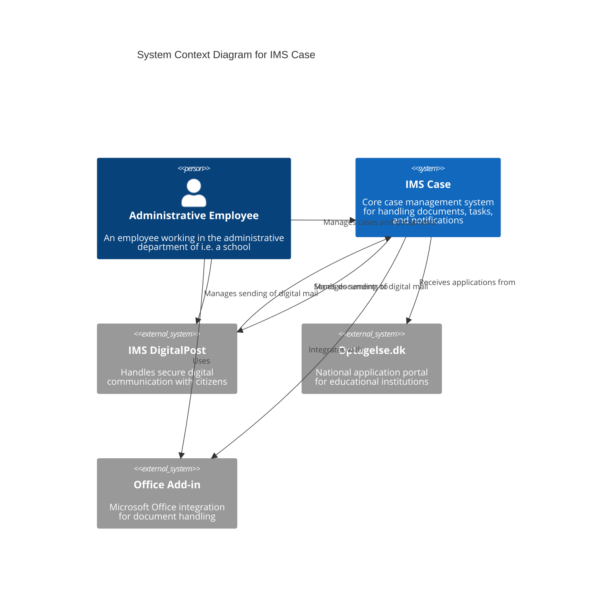

# System Context diagram showing IMS Case and its interactions with external systems

This diagram shows:
- IMS Case as the central system
- External systems that interact with IMS Case
- The key users/actors of the system
- The main relationships between systems

 
 

