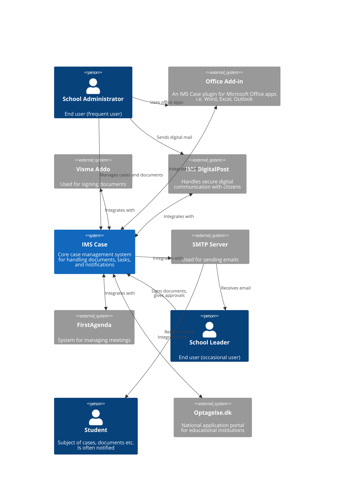

# System Context Diagram for IMS Case

This diagram shows:
- IMS Case as the central system
- External systems that interact with IMS Case
- The key users/actors of the system
- The main relationships between systems

