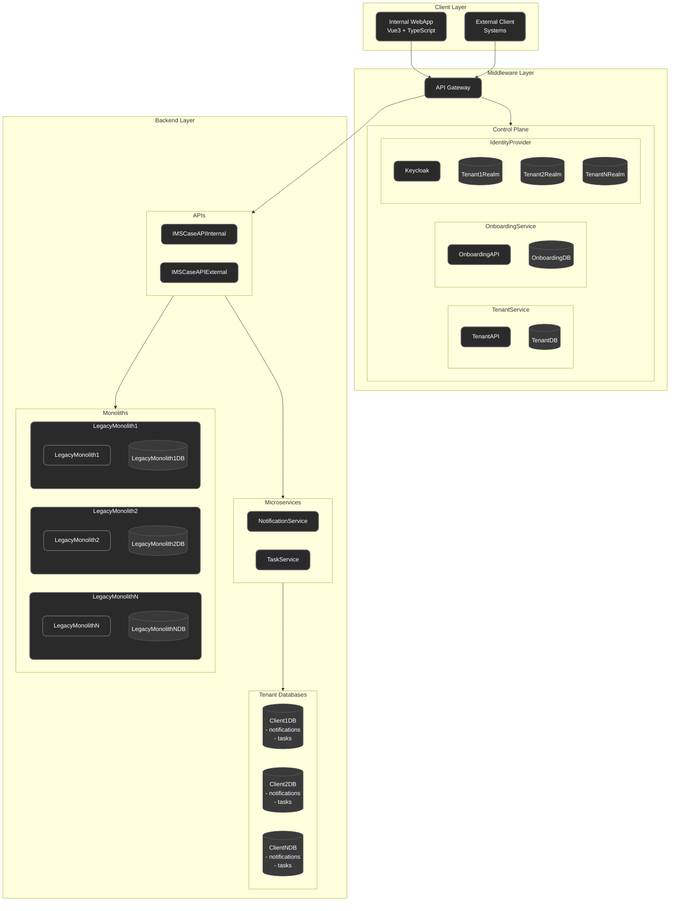

# Deployment diagram showing the infrastructure and how the software system's containers are deployed

This diagram shows:

- The physical/virtual infrastructure that the system runs on
- How each service is deployed as a separate container/unit
- Details about deployment nodes, network boundaries, etc.
- Clear layering: Client → Middleware → Backend
- Database architecture showing siloed tenant databases
- Separation between internal and external API access patterns
- Basic communication flows between main components

 
 

