```mermaid
flowchart LR

    %% Styling
    classDef description stroke-width:0px, color:#fff, fill:transparent, font-size:12px

    %% Components
    Client1((client1.imscase.dk))

    subgraph Frontend
        FrontendDescription["\- WebApp <br> \- TypeScript <br> \- Vue3 <br> \- Vuetify <br>\- Pinia"]:::description
    end

    subgraph LegacyMonolith1
        LegacyMonolith1Description["\- Java monolith <br> \- Built on Alfresco ECM <br> \- Will be gradually outphased for microservices"]:::description
    end
    subgraph LegacyMonolith2
        LegacyMonolith2Description["\- Java monolith <br> \- Built on Alfresco ECM <br> \- Will be gradually outphased for microservices"]:::description
    end

    Client2((client2.imsdigitalpost.dk))

    subgraph EmailSenderAPI
        EmailSenderAPIDescription["<br>- C# API (dapr) <br>- Subscribes to EmailTemplatePopulated event"]:::description
    end

        subgraph EmailTemplateAPI
            EmailTemplateAPIDescription["<br>- C# API (dapr) <br>- Lets users CRUD their custom email templates <br>- Subsribes to PopulateEmailTemplate event <br>- (Maybe: Lets users preview what the final email will look like) <br>"]:::description
            Client1EmailTemplateDB@{ shape: cyl, label: "client1.emailTemplates \n -PostgreSQL" }
            Client2EmailTemplateDB@{ shape: cyl, label: "client2.emailTemplates \n -PostgreSQL" }
        end


    subgraph NotificationAPI
        NotificationAPIDescription["<br>- C# API (dapr) <br>- Lets users CRUD notification settings <br>- Stores notifications for all users across all tenants <br>- Stores notification preferences for all users across all tenants <br>- Subscribes to NotificationInitialized event"]:::description
        Client1NotificationDB@{ shape: cyl, label: "client1.notifications \n -PostgreSQL schema" }
        Client2NotificationDB@{ shape: cyl, label: "client2.notifications \n -PostgreSQL schema" }
    end

    %% Relationships
    Client1 -->|Uploads document to a case| Frontend

    Frontend -->|Uploads document to a case| LegacyMonolith1

    Client2 -->|"Integrates with <br> (Uploads document to a case)"| LegacyMonolith2

    LegacyMonolith1 -->|Notify case owner about the upload| NotificationAPI

    LegacyMonolith2 -->|Notify case owner about the upload| NotificationAPI

    NotificationAPI-->|Publishes event PopulateEmailTemplate|EmailTemplateAPI
    
    NotificationAPI-->|"POST api/notification"|LegacyMonolithNotificationWebScript

    EmailTemplateAPI-->|Publishes event EmailTemplatePopulated|EmailSenderAPI

    EmailSenderAPI -->|"Connects to SMTP-server and sends the email"|SMTPServer["SMTP Server, external (heysender.com)"]

```

# Container diagram displaying the communication flow when an action takes place that results in notification being sent

- dapr enables an API to subscribe to events (so it works as a hybrid between a service worker and an API).
- The data partitioning strategy is siloed, meaning that client1 has one database which is used to centrallt store all data for client.
- Each microservice has a corresponding database schema, i.e. client1.notifications, client1.tasks etc. (same goes for client2, clientN).
- The depicted databases are logical representations, because it would be too cumbersome to show the physical separation in this diagram.
- This siloed data partitioning strategy ensures strong physical data separation, which is important for compliance reasons, and it makes it easier to backup and copy i.e. client1's database specifically. Errors in data will be isolated to the client's database as well.
- The diagram depicts the use case where a user uploads a document to a case and a notification is triggered.

 
 
 
 
 

