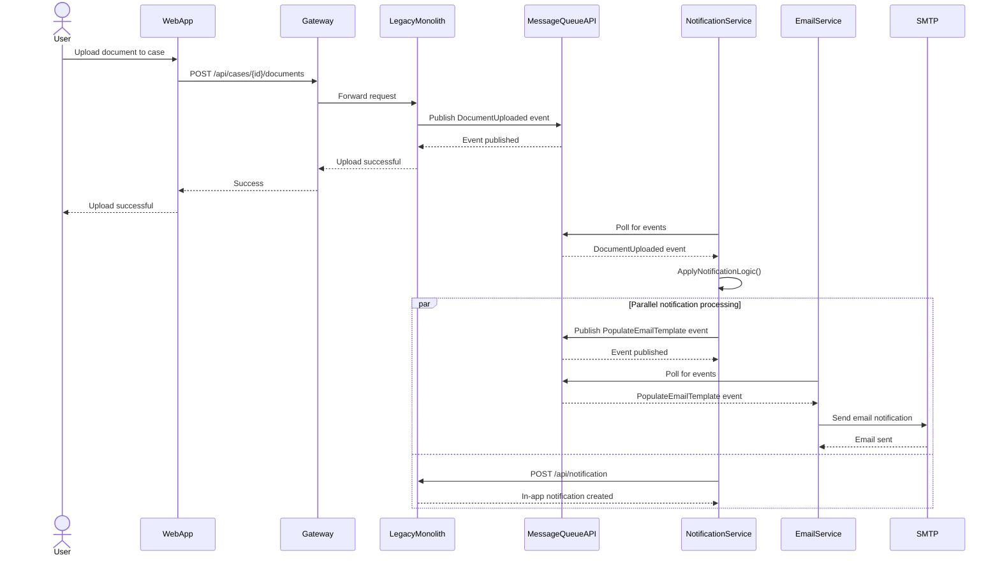

# Sequence diagram showing the notification flow when uploading a document

```mermaid
sequenceDiagram
    actor User
    participant WebApp
    participant Gateway
    participant LegacyMonolith
    participant MessageQueueAPI
    participant NotificationService
    participant EmailService
    participant SMTP
    
    %% Quick response to user
    User->>WebApp: Upload document to case
    WebApp->>Gateway: POST /api/cases/{id}/documents
    Gateway->>LegacyMonolith: Forward request
    
    %% Async notification handling
    LegacyMonolith->>MessageQueueAPI: Publish DocumentUploaded event
    MessageQueueAPI-->>LegacyMonolith: Event published
    LegacyMonolith-->>Gateway: Upload successful
    Gateway-->>WebApp: Success
    WebApp-->>User: Upload successful
    
    %% Background processing
    NotificationService->>MessageQueueAPI: Poll for events
    MessageQueueAPI-->>NotificationService: DocumentUploaded event
    
    NotificationService->>NotificationService: ApplyNotificationLogic()
    
    par Parallel notification processing
        %% Email notification flow
        NotificationService->>MessageQueueAPI: Publish PopulateEmailTemplate event
        MessageQueueAPI-->>NotificationService: Event published
        EmailService->>MessageQueueAPI: Poll for events
        MessageQueueAPI-->>EmailService: PopulateEmailTemplate event
        EmailService->>SMTP: Send email notification
        SMTP-->>EmailService: Email sent
        
        and
        %% In-app notification flow
        NotificationService->>LegacyMonolith: POST /api/notification
        LegacyMonolith-->>NotificationService: In-app notification created
    end
``` 