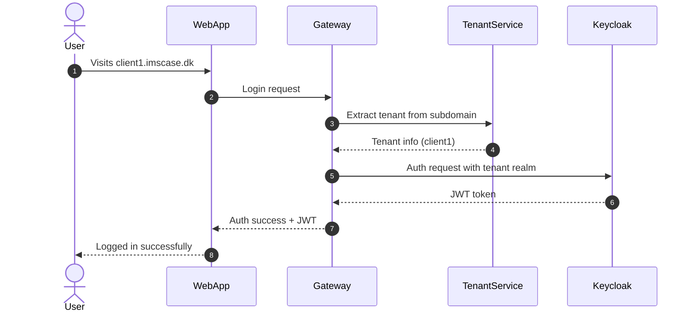

# Sequence diagram showing the login flow with tenant recognition

- Once the user is logged in, the JWT is attached to all requests.
- It is therefore only necessary to look up the tenant on the first request.

 
 

