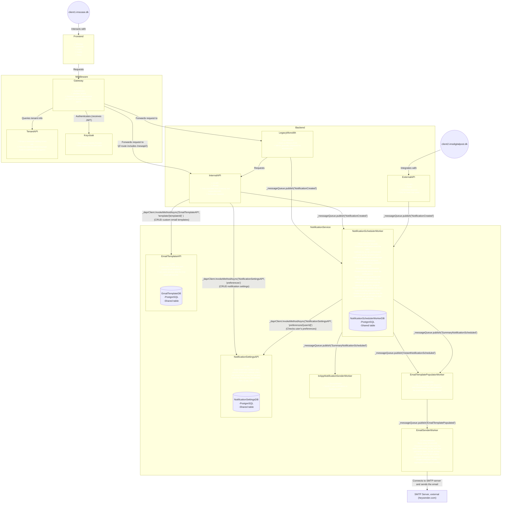

# Questions to be answered

- Should the gateway create a tracingId/correlationId that is propagated with all subsequent requests?
- Or should we "just" use Dapr for all communication which then provides out-of-the-box distributed tracing
- Do we need to support the ability to see a communication log (See what has been sent to a specific contact). Or is this too CRM-ish?

