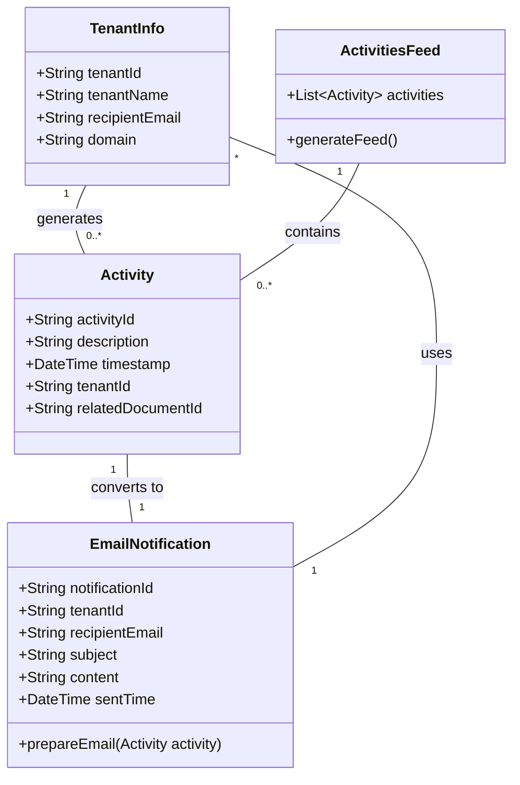

```mermaid
classDiagram
    class TenantInfo {
        +String tenantId
        +String tenantName
        +String recipientEmail
        +String domain
    }

    class Activity {
        +String activityId
        +String description
        +DateTime timestamp
        +String tenantId
        +String relatedDocumentId
    }

    class ActivitiesFeed {
        +List~Activity~ activities
        +generateFeed()
    }

    class EmailNotification {
        +String notificationId
        +String tenantId
        +String recipientEmail
        +String subject
        +String content
        +DateTime sentTime
        +prepareEmail(Activity activity)
    }

    TenantInfo "1" -- "0..*" Activity: generates
    ActivitiesFeed "1" -- "0..*" Activity: contains
    Activity "1" -- "1" EmailNotification: converts to
    EmailNotification "1" -- "*" TenantInfo: uses
```