## MessageQueueAPI

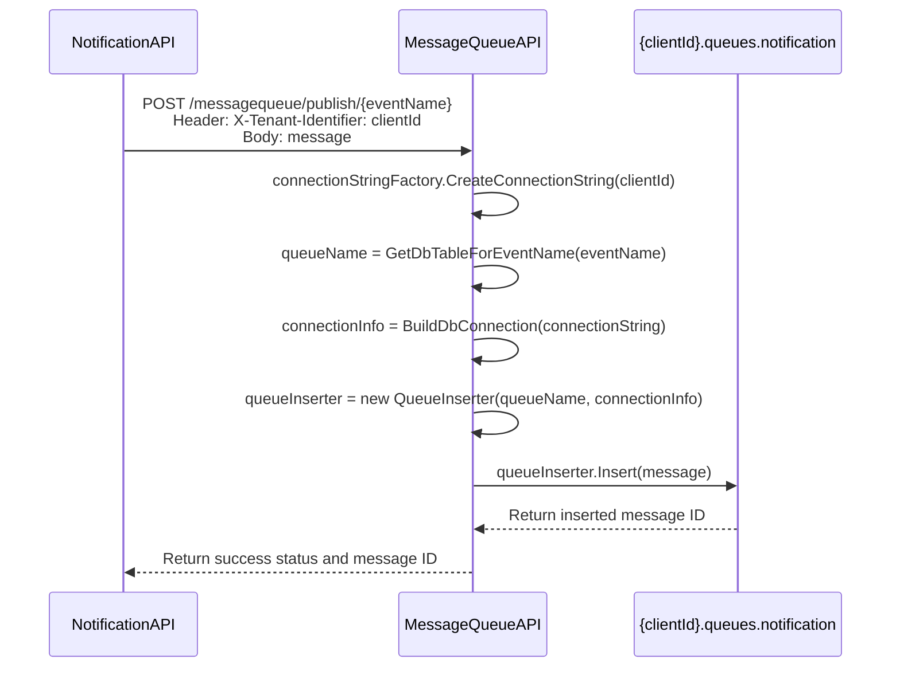

 
 
 
 
 

## NotificationAPI

### NotificationAPI.BackgroundService

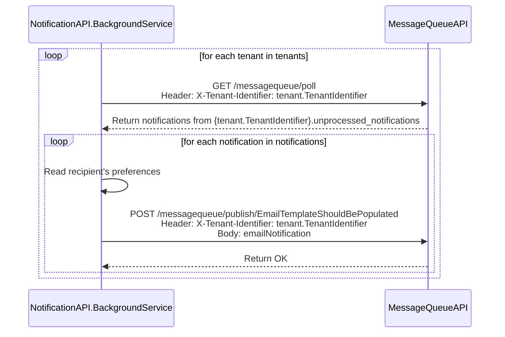

### NotificationAPI.API

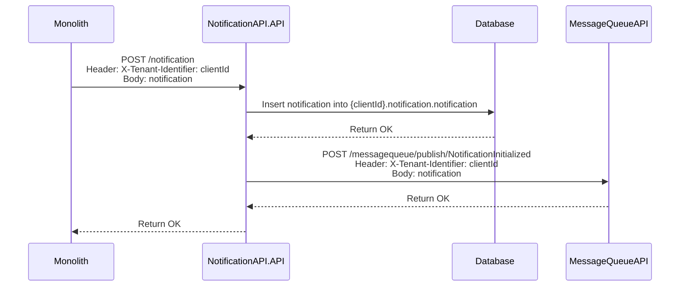

 
 
 
 
 

## EmailTemplateAPI

### EmailTemplateAPI.BackgroundService

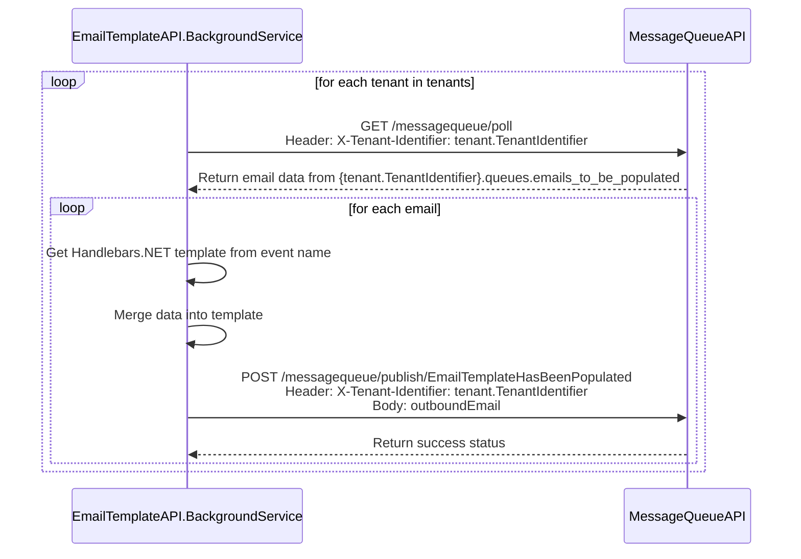

### EmailTemplateAPI.API

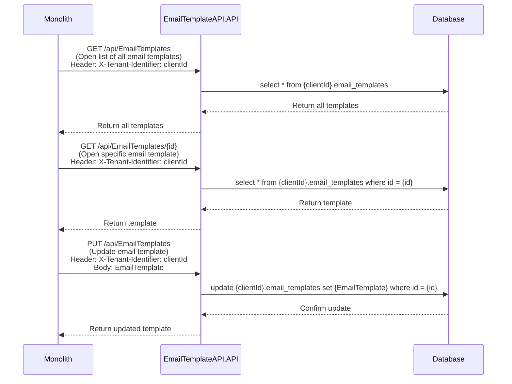

 
 
 
 
 

## EmailSenderAPI

### EmailSenderAPI.BackgroundService

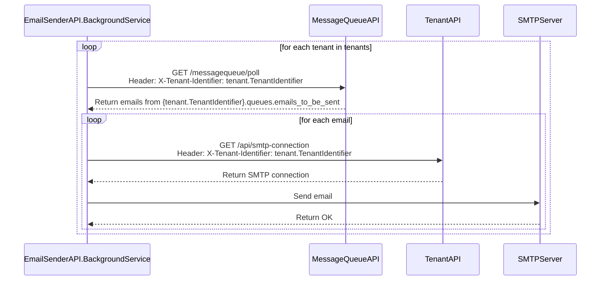

 
 
 
 
 

## TenantAPI

### TenantAPI.OnboardTenant

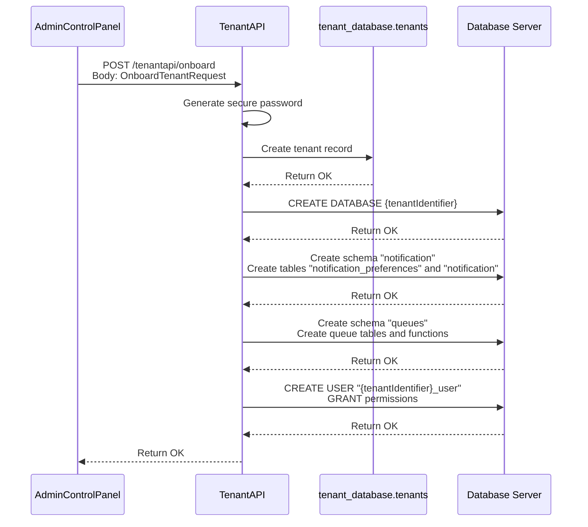

## Udfordringer

### Setting up LISTEN/NOTIFY connection with NotificationAPI and database

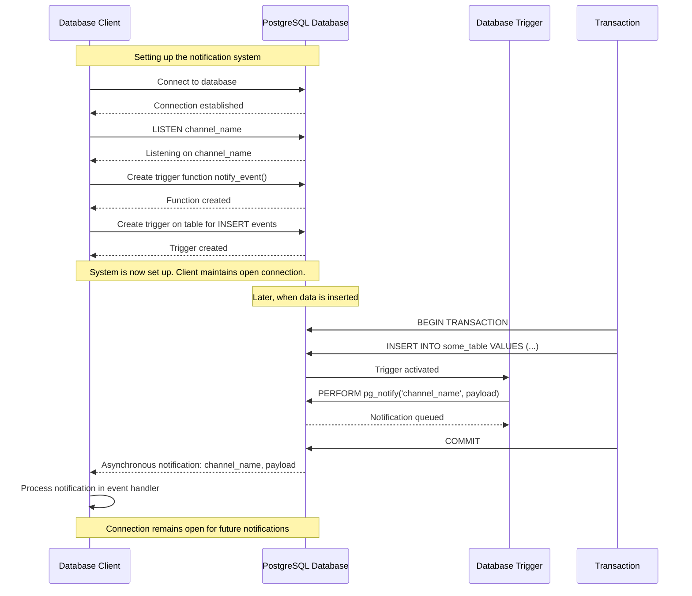

### PostgreSQL 17 LISTEN/NOTIFY solution

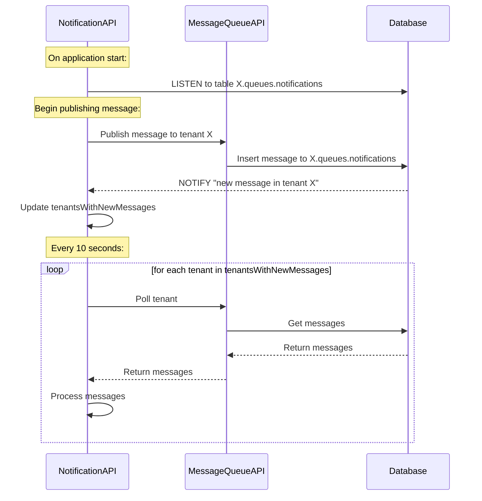

### Custom solution without LISTEN/NOTIFY

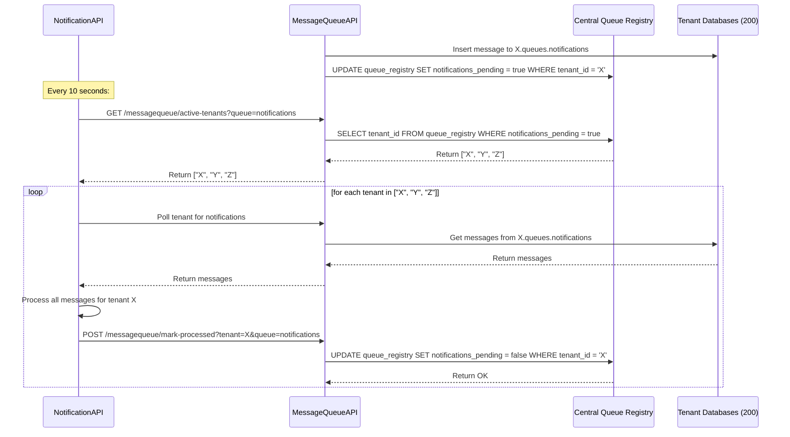

### MessageQueueAPI can now do multi-tenant bulk polling

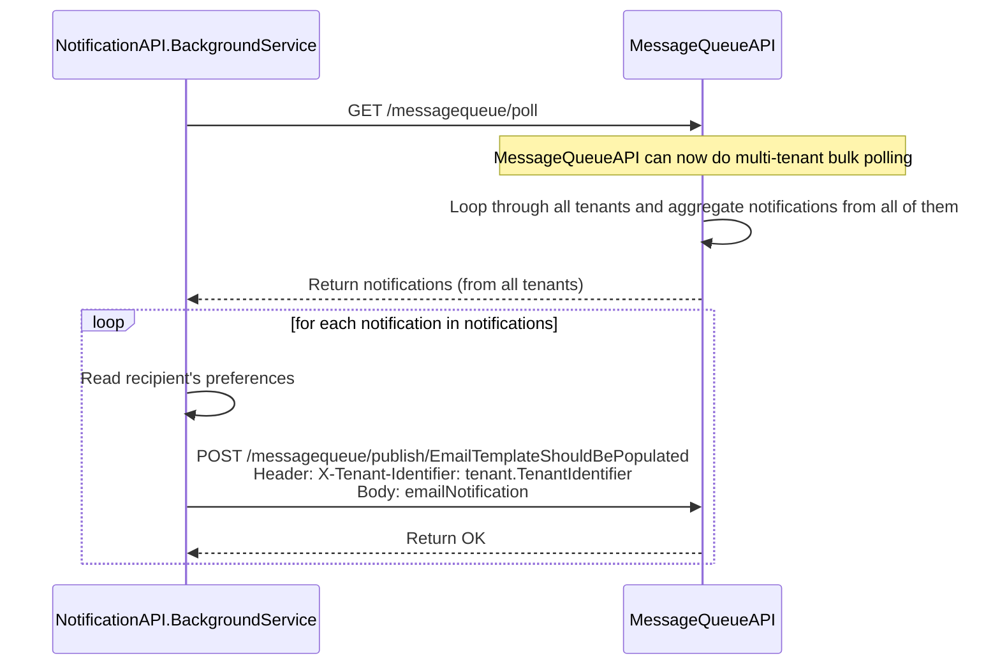

### Cursor's suggestion for a custom solution that is less coupled than the one above

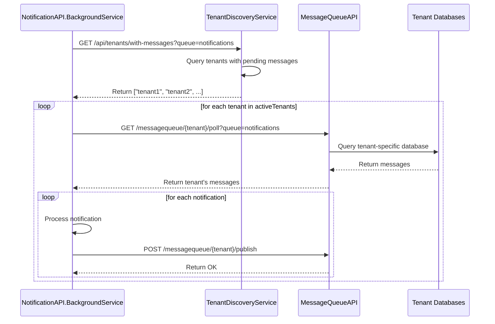

### It can then easily be replaced with RabbitMQ

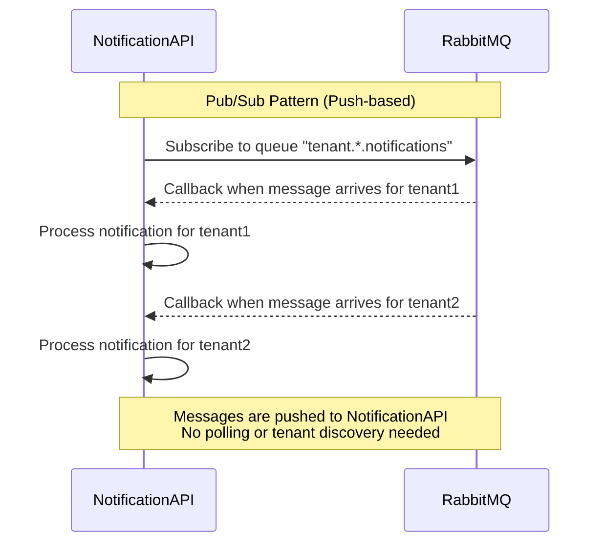

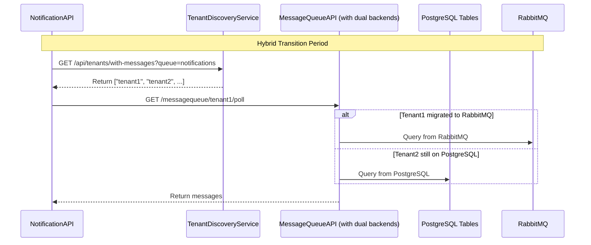