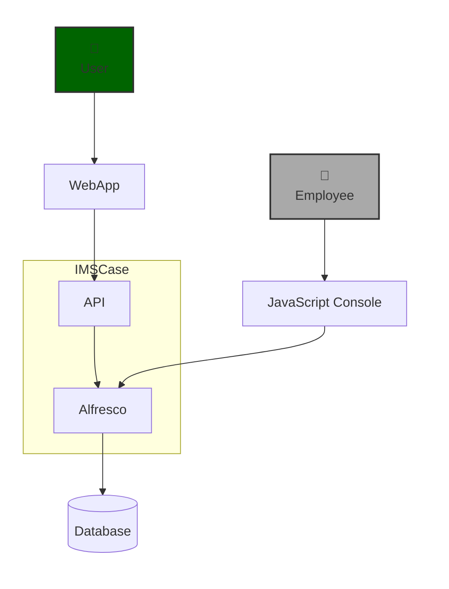

# Analysis of the current architecture (The report I am writing is in Danish)

## High level deployment diagram

```mermaid
flowchart LR

        subgraph 1[" "]

            subgraph C50["Customer 50"]
                direction TB
                subgraph APP50["IMS Case"]
                    ALF50["Alfresco"]
                end
                APP50 --> DB50[(Database)]
            end

            subgraph C7["..."]
            end

            subgraph C6["Customer 6"]
                direction TB
                subgraph APP6["IMS Case"]
                    ALF6["Alfresco"]
                end
                APP6 --> DB6[(Database)]
            end

            subgraph C5["Customer 5"]
                direction TB
                subgraph APP5["IMS Case"]
                    ALF5["Alfresco"]
                end
                APP5 --> DB5[(Database)]
            end

            subgraph C4["Customer 4"]
                direction TB
                subgraph APP4["IMS Case"]
                    ALF4["Alfresco"]
                end
                APP4 --> DB4[(Database)]
            end

            subgraph C3["Customer 3"]
                direction TB
                subgraph APP3["IMS Case"]
                    ALF3["Alfresco"]
                end
                APP3 --> DB3[(Database)]
            end

            subgraph C2["Customer 2"]
                direction TB
                subgraph APP2["IMS Case"]
                    ALF2["Alfresco"]
                end
                APP2 --> DB2[(Database)]
            end

            subgraph C1["Customer 1"]
                direction TB
                subgraph APP1["IMS Case"]
                    ALF1["Alfresco"]
                end
                APP1 --> DB1[(Database)]
            end
        end

        subgraph 2[" "]

            subgraph C100["Customer 100"]
                direction TB
                subgraph APP100["IMS Case"]
                    ALF100["Alfresco"]
                end
                APP100 --> DB100[(Database)]
            end

            subgraph C57["..."]
                direction TB
            end

            subgraph C56["Customer 56"]
                direction TB
                subgraph APP56["IMS Case"]
                    ALF56["Alfresco"]
                end
                APP56 --> DB56[(Database)]
            end

            subgraph C55["Customer 55"]
                direction TB
                subgraph APP55["IMS Case"]
                    ALF55["Alfresco"]
                end
                APP55 --> DB55[(Database)]
            end

            subgraph C54["Customer 54"]
                direction TB
                subgraph APP54["IMS Case"]
                    ALF54["Alfresco"]
                end
                APP54 --> DB54[(Database)]
            end

            subgraph C53["Customer 53"]
                direction TB
                subgraph APP53["IMS Case"]
                    ALF53["Alfresco"]
                end
                APP53 --> DB53[(Database)]
            end

            subgraph C52["Customer 52"]
                direction TB
                subgraph APP52["IMS Case"]
                    ALF52["Alfresco"]
                end
                APP52 --> DB52[(Database)]
            end

            subgraph C51["Customer 51"]
                direction TB
                subgraph APP51["IMS Case"]
                    ALF51["Alfresco"]
                end
                APP51 --> DB51[(Database)]
            end
        end

        subgraph 3[" "]

            subgraph C150["Customer 150"]
                direction TB
                subgraph APP150["IMS Case"]
                    ALF150["Alfresco"]
                end
                APP150 --> DB150[(Database)]
            end

            subgraph C107["..."]
                direction TB
            end

            subgraph C106["Customer 106"]
                direction TB
                subgraph APP106["IMS Case"]
                    ALF106["Alfresco"]
                end
                APP106 --> DB106[(Database)]
            end

            subgraph C105["Customer 105"]
                direction TB
                subgraph APP105["IMS Case"]
                    ALF105["Alfresco"]
                end
                APP105 --> DB105[(Database)]
            end

            subgraph C104["Customer 104"]
                direction TB
                subgraph APP104["IMS Case"]
                    ALF104["Alfresco"]
                end
                APP104 --> DB104[(Database)]
            end

            subgraph C103["Customer 103"]
                direction TB
                subgraph APP103["IMS Case"]
                    ALF103["Alfresco"]
                end
                APP103 --> DB103[(Database)]
            end

            subgraph C102["Customer 102"]
                direction TB
                subgraph APP102["IMS Case"]
                    ALF102["Alfresco"]
                end
                APP102 --> DB102[(Database)]
            end

            subgraph C101["Customer 101"]
                direction TB
                subgraph APP101["IMS Case"]
                    ALF101["Alfresco"]
                end
                APP101 --> DB101[(Database)]
            end
        end


        subgraph 4[" "]

            subgraph C200["Customer 200"]
                direction TB
                subgraph APP200["IMS Case"]
                    ALF200["Alfresco"]
                end
                APP200 --> DB200[(Database)]
            end

            subgraph C157["..."]
                direction TB
            end

            subgraph C156["Customer 156"]
                direction TB
                subgraph APP156["IMS Case"]
                    ALF156["Alfresco"]
                end
                APP156 --> DB156[(Database)]
            end

            subgraph C155["Customer 155"]
                direction TB
                subgraph APP155["IMS Case"]
                    ALF155["Alfresco"]
                end
                APP155 --> DB155[(Database)]
            end

            subgraph C154["Customer 154"]
                direction TB
                subgraph APP154["IMS Case"]
                    ALF154["Alfresco"]
                end
                APP154 --> DB154[(Database)]
            end

            subgraph C153["Customer 153"]
                direction TB
                subgraph APP153["IMS Case"]
                    ALF153["Alfresco"]
                end
                APP153 --> DB153[(Database)]
            end

            subgraph C152["Customer 152"]
                direction TB
                subgraph APP152["IMS Case"]
                    ALF152["Alfresco"]
                end
                APP152 --> DB152[(Database)]
            end

            subgraph C151["Customer 151"]
                direction TB
                subgraph APP151["IMS Case"]
                    ALF151["Alfresco"]
                end
                APP151 --> DB151[(Database)]
            end
        end


    %% Make subgraphs transparent
    style 1 fill:transparent,stroke:transparent
    style 2 fill:transparent,stroke:transparent
    style 3 fill:transparent,stroke:transparent
    style 4 fill:transparent,stroke:transparent
    style C7 stroke:transparent
    style C107 stroke:transparent
    style C157 stroke:transparent
    style C57 stroke:transparent

 %% Style for IMS Case boxes - black fill with white stroke
    style APP1 fill:#000,stroke:#fff,stroke-width:1px,color:#fff
    style APP2 fill:#000,stroke:#fff,stroke-width:1px,color:#fff
    style APP3 fill:#000,stroke:#fff,stroke-width:1px,color:#fff
    style APP4 fill:#000,stroke:#fff,stroke-width:1px,color:#fff
    style APP5 fill:#000,stroke:#fff,stroke-width:1px,color:#fff
    style APP6 fill:#000,stroke:#fff,stroke-width:1px,color:#fff
    style APP50 fill:#000,stroke:#fff,stroke-width:1px,color:#fff

    style APP51 fill:#000,stroke:#fff,stroke-width:1px,color:#fff
    style APP52 fill:#000,stroke:#fff,stroke-width:1px,color:#fff
    style APP53 fill:#000,stroke:#fff,stroke-width:1px,color:#fff
    style APP54 fill:#000,stroke:#fff,stroke-width:1px,color:#fff
    style APP55 fill:#000,stroke:#fff,stroke-width:1px,color:#fff
    style APP56 fill:#000,stroke:#fff,stroke-width:1px,color:#fff
    style APP100 fill:#000,stroke:#fff,stroke-width:1px,color:#fff
    
    style APP101 fill:#000,stroke:#fff,stroke-width:1px,color:#fff
    style APP102 fill:#000,stroke:#fff,stroke-width:1px,color:#fff
    style APP103 fill:#000,stroke:#fff,stroke-width:1px,color:#fff
    style APP104 fill:#000,stroke:#fff,stroke-width:1px,color:#fff
    style APP105 fill:#000,stroke:#fff,stroke-width:1px,color:#fff
    style APP106 fill:#000,stroke:#fff,stroke-width:1px,color:#fff
    style APP150 fill:#000,stroke:#fff,stroke-width:1px,color:#fff

    style APP151 fill:#000,stroke:#fff,stroke-width:1px,color:#fff
    style APP152 fill:#000,stroke:#fff,stroke-width:1px,color:#fff
    style APP153 fill:#000,stroke:#fff,stroke-width:1px,color:#fff
    style APP154 fill:#000,stroke:#fff,stroke-width:1px,color:#fff
    style APP155 fill:#000,stroke:#fff,stroke-width:1px,color:#fff
    style APP156 fill:#000,stroke:#fff,stroke-width:1px,color:#fff
    style APP200 fill:#000,stroke:#fff,stroke-width:1px,color:#fff

```

 
 
 
 
 

## Teknikere går udenom applikationen og omgår derved en stor del af forretningslogikken

 
 
 
 
 

## 