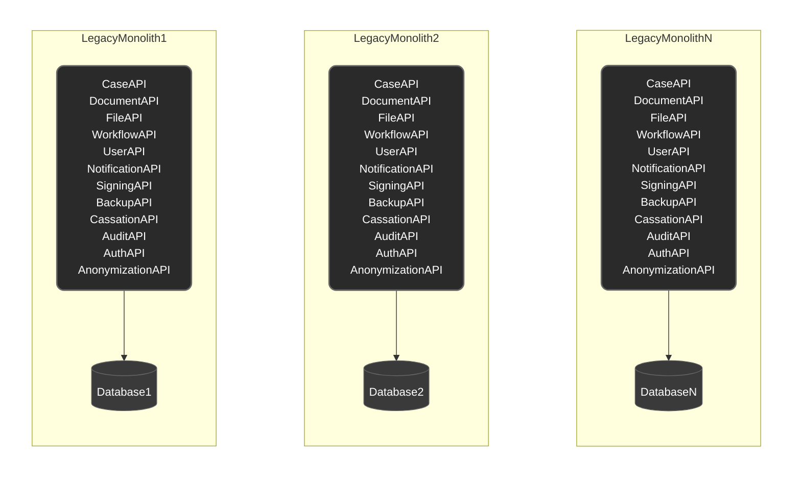
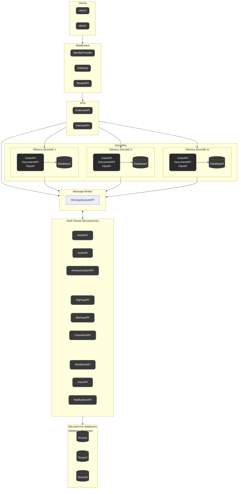

# Design af fremtidens arkitektur

## Diagram1: AS IS

 
 
 
 
 

## Diagram2: TO BE

 
 
 
 
 

## Diagram3: TO BE (but too far fetched bearing in mind the current state of business and technical maturity)

```mermaid
flowchart TD
    %% Define styles for all diagram elements
    classDef monolith fill:#2a2a2a,stroke:#666,stroke-width:2px,color:#fff,rx:10
    classDef microservice fill:#3a3a3a,stroke:#666,stroke-width:2px,color:#fff,rx:10
    classDef database fill:#3a3a3a,stroke:#666,stroke-width:1px,color:#fff
    classDef tenant fill:#1a1a1a,stroke:#666,stroke-width:2px,color:#fff,rx:0
    classDef messageBroker fill:#1a1a1a,stroke:#666,stroke-width:2px,color:#fff,rx:5

    subgraph Clients
        subgraph client1
        end
        subgraph client2
        end
    end

    subgraph Middleware
        subgraph TenantAPI
        end
        subgraph Gateway
        end
        subgraph IdentityProvider
        end
    end

    subgraph MessageBroker["Message Broker"]
        MessageBus["RabbitMQ"]
    end

    subgraph MultiTenantServices["Multi-Tenant Microservices"]
        subgraph ServiceSet1[" "]
            direction LR
            WorkflowAPI["WorkflowAPI"]
            UserAPI["UserAPI"]
            NotificationAPI["NotificationAPI"]
        end

        subgraph ServiceSet2[" "]
            direction LR
            SigningAPI["SigningAPI"]
            BackupAPI["BackupAPI"]
            CassationAPI["CassationAPI"]
        end

        subgraph ServiceSet3[" "]
            direction LR
            AuditAPI["AuditAPI"]
            AuthAPI["AuthAPI"]
            AnonymizationAPI["AnonymizationAPI"]
        end

        subgraph ServiceSet4[" "]
            direction LR
            CaseAPI["CaseAPI"]
            DocumentAPI["DocumentAPI"]
            FileAPI["FileAPI"]
        end
    end

    subgraph MicroserviceDatabase["Microservice databases <br> database-per-tenant"]
        TenantDB1[(Tenant1)]
        TenantDB2[(Tenant2)]
        TenantDBN[(TenantN)]
    end

    %% Client and API gateway interactions
    Clients --> Middleware
    Middleware --> MultiTenantServices

    %% Database interactions
    MultiTenantServices --> MicroserviceDatabase

    %% Event-driven communication through message broker
    MultiTenantServices <--> MessageBus

    %% Apply classes
    class WorkflowAPI,UserAPI,NotificationAPI,SigningAPI,BackupAPI,CassationAPI,AuditAPI,AuthAPI,AnonymizationAPI,CaseAPI,DocumentAPI,FileAPI microservice
    class DB1,DB2,DBN,TenantDB1,TenantDB2,TenantDBN database
    class MessageBus messageBroker

    %% Make service set containers invisible
    style ServiceSet1 fill:transparent,stroke:transparent
    style ServiceSet2 fill:transparent,stroke:transparent
    style ServiceSet3 fill:transparent,stroke:transparent
    style ServiceSet4 fill:transparent,stroke:transparent
```

