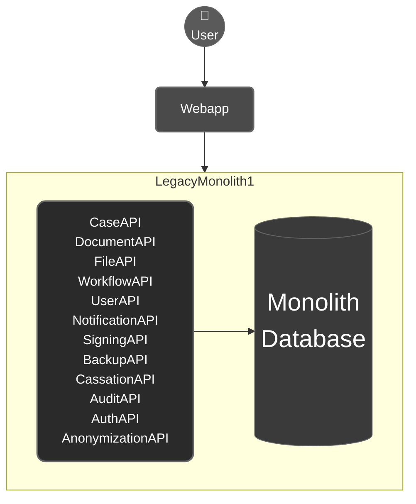
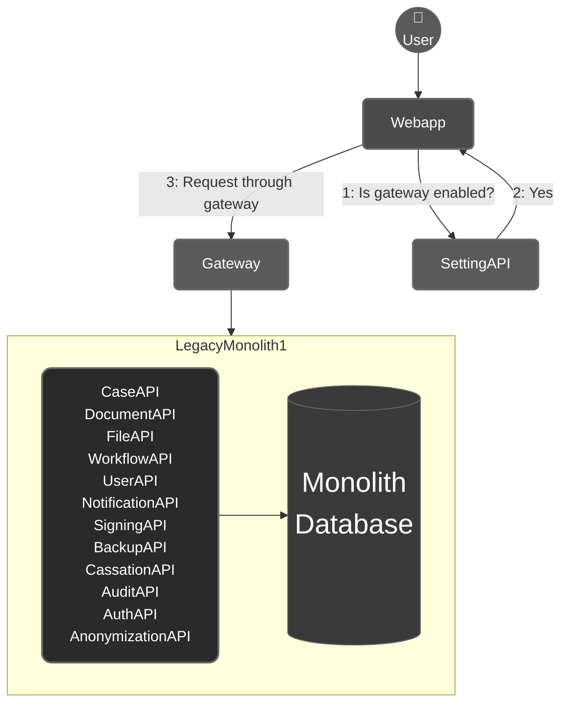
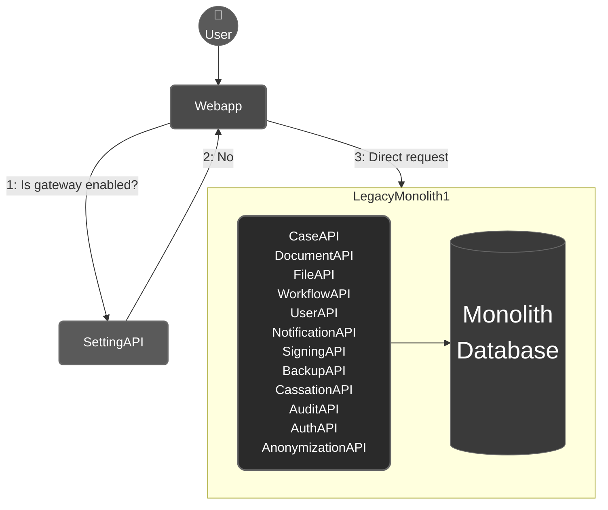
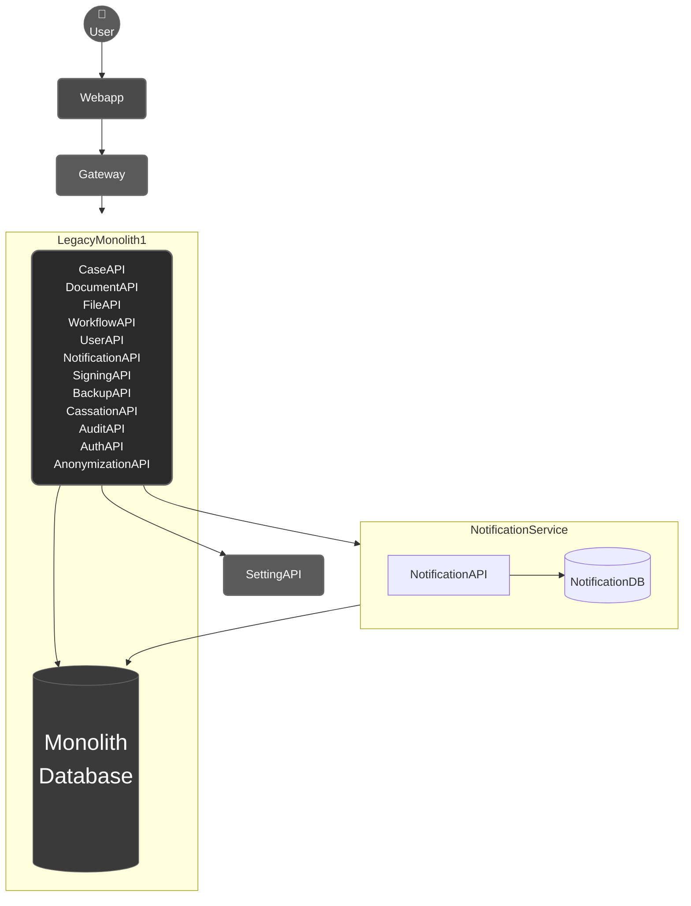
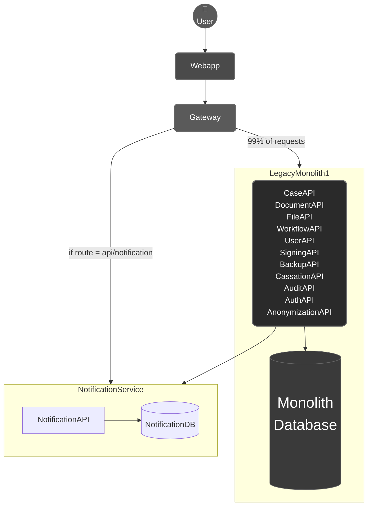
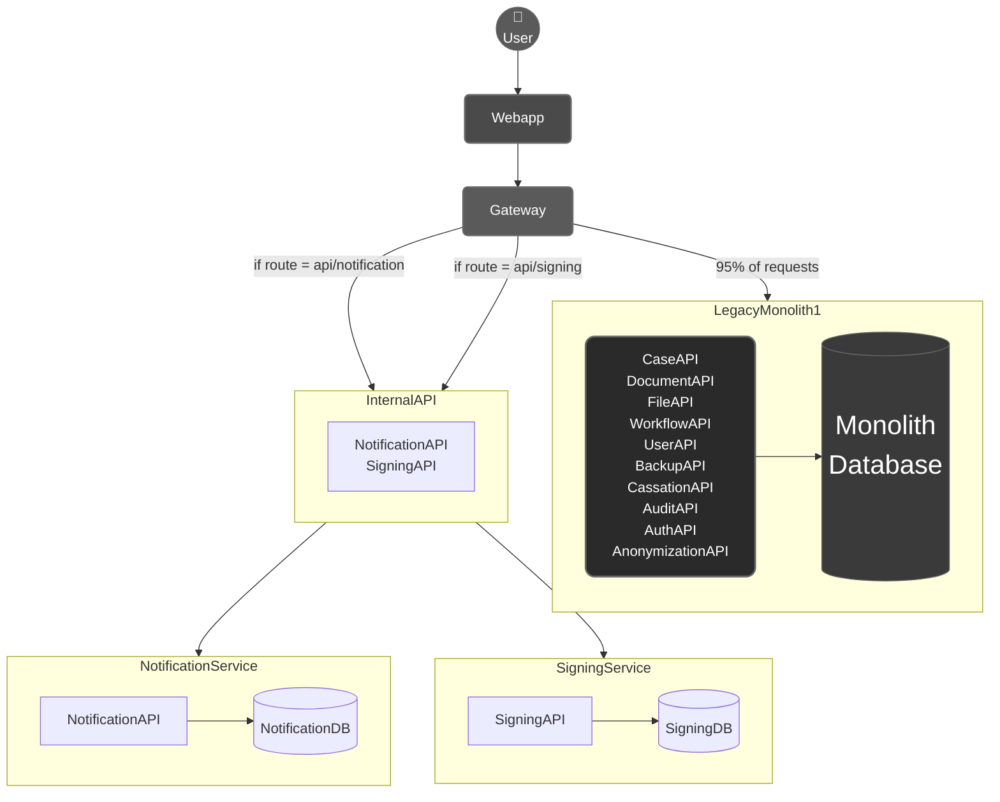
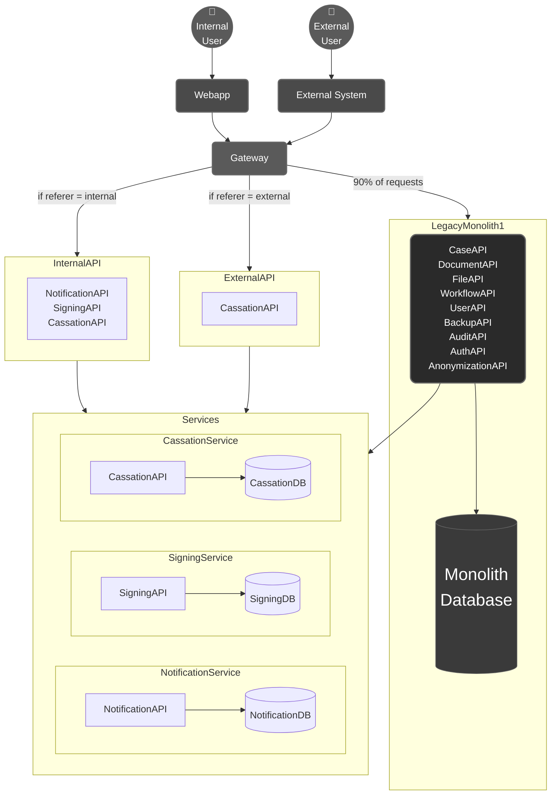

# Strangler fig step-by-step monolith to microservices migration

## Diagram 1: The current system.

 
 
 
 
 

## Diagram 2: Gateway and SettingAPI are added.

## Diagram 2.1: Gateway is broken and thus bypassed so the webapp goes directly to the monolith.

 
 
 
 
 

## Diagram 3: Notifications are still stored in the monolith database, but the preferences and sending logic are moved to a new microservice.

 
 
 
 
 

## Diagram 4: NotificationAPI is completely moved to its own microservice, which is hidden under the InternalAPI. The Gateway redirects traffic to both systems, but most traffic is redirected to the monolith.

 
 
 
 
 

## Diagram 5: Both NotificationAPI and SigningAPI are moved to their own microservices, hidden under the InternalAPI. The Gateway redirects traffic to all systems.

 
 
 
 
 

## Diagram 6: ExternalAPI is added by the side of the InternalAPI. This handles all requests from integrating systems (so not the webapp).

 
 
 
 
 

## Diagram 7: Most APIs are moved to microservices, leaving only core document management in the monolith.

```mermaid
flowchart TD
    classDef monolith fill:#2a2a2a,stroke:#666,stroke-width:2px,color:#fff,rx:10,font-size:25px
    classDef database fill:#3a3a3a,stroke:#666,stroke-width:1px,color:#fff,font-size:25px
    classDef webapp fill:#4a4a4a,stroke:#666,stroke-width:2px,color:#fff,rx:5,font-size:30px
    classDef gateway fill:#5a5a5a,stroke:#666,stroke-width:2px,color:#fff,rx:5,font-size:30px
    classDef user fill:#5a5a5a,stroke:#666,stroke-width:1px,color:#fff,shape:circle,font-size:30px
    classDef column fill:transparent,stroke:transparent,stroke-width:0px,font-size:30px
    classDef microservice stroke:#666,stroke-width:2px,color:#fff,rx:10,font-size:25px
    classDef microdb stroke:#666,stroke-width:1px,color:#fff,font-size:25px
    classDef internalapi stroke:#666,stroke-width:2px,color:#fff,rx:5,font-size:20px
    classDef microserviceLayer font-size:20px
    classDef legacyMonolith1 font-size:20px
    classDef endpoint font-size:25px

    User((👤 <br> User))
    Webapp[Webapp]
    Gateway[Gateway]

    User --> Webapp
    Webapp --> Gateway

    subgraph LegacyMonolith1["LegacyMonolith1"]
        LM1["CaseAPI<br>DocumentAPI<br>FileAPI"]
        DB1[("Monolith<br>Database")]
        LM1 --> DB1
    end

    Gateway -->|"30% of requests"| LegacyMonolith1

    subgraph InternalAPI["Internal API Layer"]

        subgraph APIColumn3[" "]
            direction LR
            AuditEndpoint["AuditAPI"]
            AuthEndpoint["AuthAPI"]
            AnonymizationEndpoint["AnonymizationAPI"]
        end

        subgraph APIColumn2[" "]
            direction LR
            SigningEndpoint["SigningAPI"]
            UserEndpoint["UserAPI"]
            CassationEndpoint["CassationAPI"]
        end

        subgraph APIColumn1[" "]
            direction LR
            NotificationEndpoint["NotificationAPI"]
            WorkflowEndpoint["WorkflowAPI"]
            BackupEndpoint["BackupAPI"]
        end

    end

    Gateway -->|"70% of requests"| InternalAPI

    subgraph MicroserviceLayer["Microservice Layer"]
        subgraph MSColumn1[" "]
            direction LR
            subgraph NotificationMS["NotificationService"]
                direction LR
                NotificationAPI[NotificationAPI]
                NotificationDB[(NotificationDB)]
                NotificationAPI --> NotificationDB
            end
            
            subgraph WorkflowMS["WorkflowService"]
                direction LR
                WorkflowAPI[WorkflowAPI]
                WorkflowDB[(WorkflowDB)]
                WorkflowAPI --> WorkflowDB
            end
            
            subgraph BackupMS["BackupService"]
                direction LR
                BackupAPI[BackupAPI]
                BackupDB[(BackupDB)]
                BackupAPI --> BackupDB
            end
        end
        
        subgraph MSColumn2[" "]
            direction LR
            subgraph SigningMS["SigningService"]
                direction LR
                SigningAPI[SigningAPI]
                SigningDB[(SigningDB)]
                SigningAPI --> SigningDB
            end
            
            subgraph UserMS["UserService"]
                direction LR
                UserAPI[UserAPI]
                UserDB[(UserDB)]
                UserAPI --> UserDB
            end
            
            subgraph CassationMS["CassationService"]
                direction LR
                CassationAPI[CassationAPI]
                CassationDB[(CassationDB)]
                CassationAPI --> CassationDB
            end
        end
        
        subgraph MSColumn3[" "]
            direction LR
            subgraph AuditMS["AuditService"]
                direction LR
                AuditAPI[AuditAPI]
                AuditDB[(AuditDB)]
                AuditAPI --> AuditDB
            end
            
            subgraph AuthMS["AuthService"]
                direction LR
                AuthAPI[AuthAPI]
                AuthDB[(AuthDB)]
                AuthAPI --> AuthDB
            end
            
            subgraph AnonymizationMS["AnonymizationService"]
                direction LR
                AnonymizationAPI[AnonymizationAPI]
                AnonymizationDB[(AnonymizationDB)]
                AnonymizationAPI --> AnonymizationDB
            end
        end
    end

    InternalAPI --> MicroserviceLayer

    %% Style column containers to be invisible
    class APIColumn1 column
    class APIColumn2 column
    class APIColumn3 column
    class MSColumn1 column
    class MSColumn2 column
    class MSColumn3 column

    class MicroserviceLayer microserviceLayer

    class LM1 monolith
    class DB1 database
    class Webapp webapp
    class Gateway gateway
    class InternalAPI internalapi
    class NotificationAPI microservice
    class NotificationDB microdb
    class SigningAPI microservice
    class SigningDB microdb
    class WorkflowAPI microservice
    class WorkflowDB microdb
    class UserAPI microservice
    class UserDB microdb
    class BackupAPI microservice
    class BackupDB microdb
    class CassationAPI microservice
    class CassationDB microdb
    class AuditAPI microservice
    class AuditDB microdb
    class AuthAPI microservice
    class AuthDB microdb
    class AnonymizationAPI microservice
    class AnonymizationDB microdb
    class User user

    class AuditEndpoint endpoint
    class AuthEndpoint endpoint
    class AnonymizationEndpoint endpoint
    class BackupEndpoint endpoint
    class CassationEndpoint endpoint
    class NotificationEndpoint endpoint
    class WorkflowEndpoint endpoint
    class SigningEndpoint endpoint
    class UserEndpoint endpoint

    class LegacyMonolith1 legacyMonolith1
```

