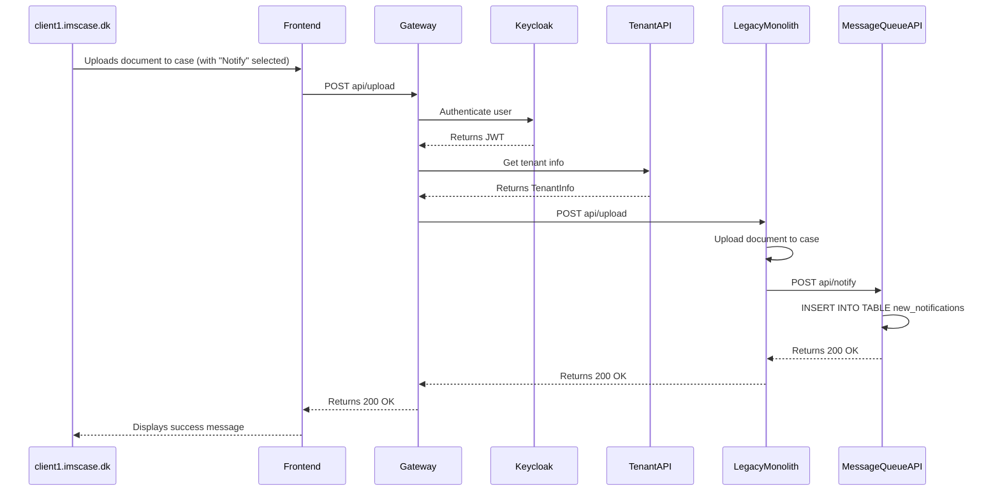
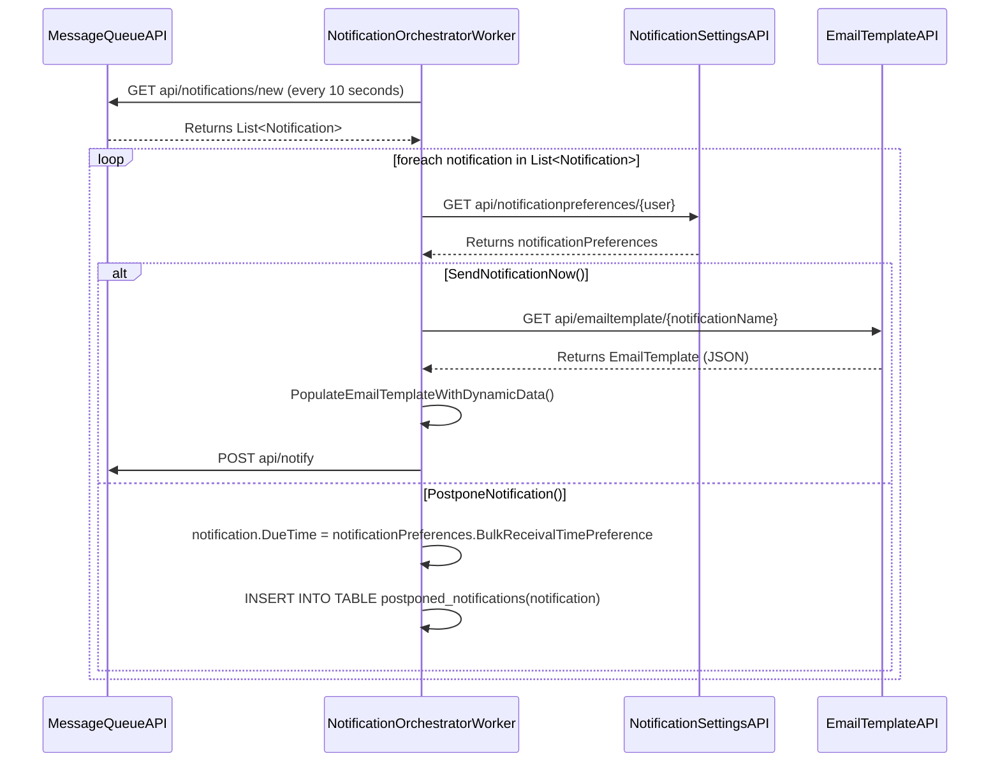
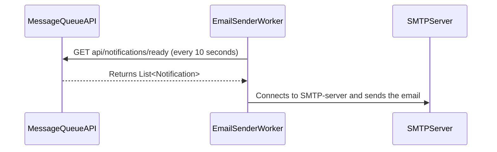
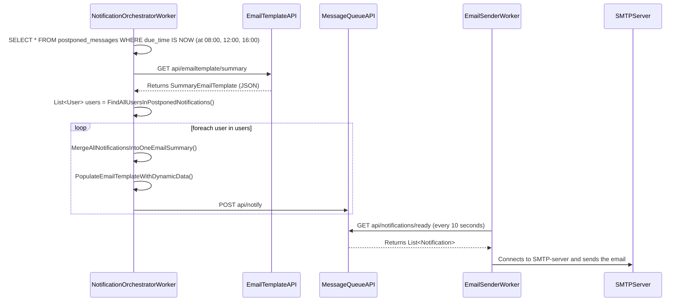

# SequenceDiagrams

## SequenceDiagram1: User uploads a document to a case (with "Notify" selected) and the notification is passed to the MessageQueueAPI

        

## SequenceDiagram2: The NotificationOrchestratorWorker runs every 10 seconds, retrieves the new notifications from the MessageQueueAPI and decides between SendNotificationNow() and PostponeNotification()

        

## SequenceDiagram3: The EmailSenderWorker runs every 10 seconds, retrieves the ready notifications from the MessageQueue and sends them to the SMTP-server

        

## SequenceDiagram4: The postponed notifications are fetched, batched into 1-email-per-user, published to MessageQueueAPI and sent via EmailSenderWorker to the SMTP-server (happens 08:00, 12:00 and 16:00)

