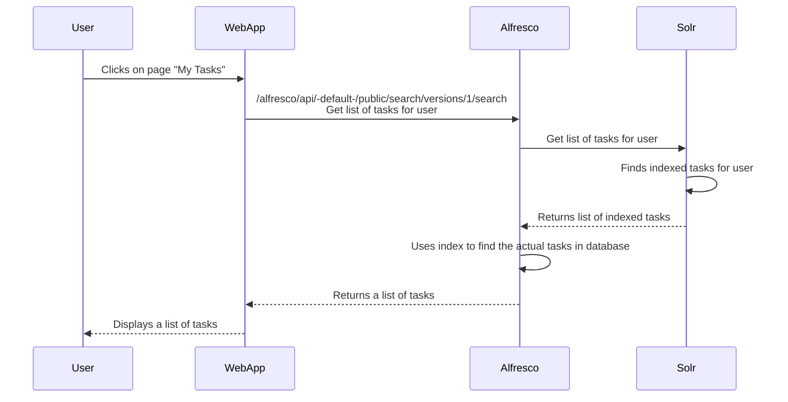
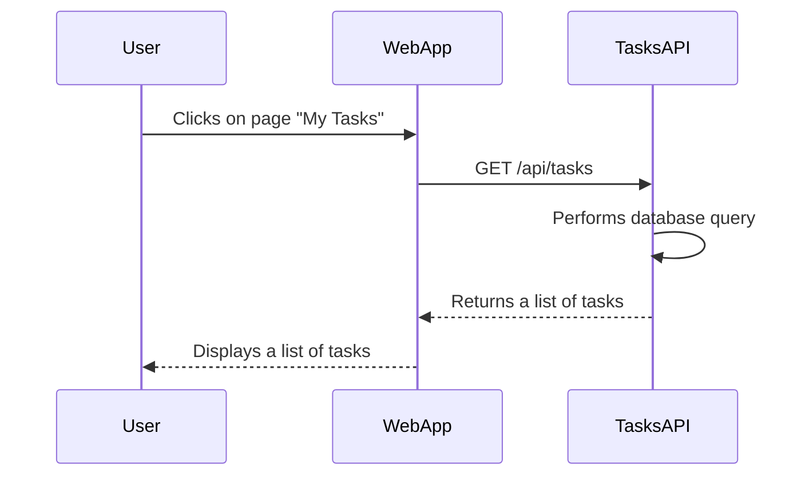
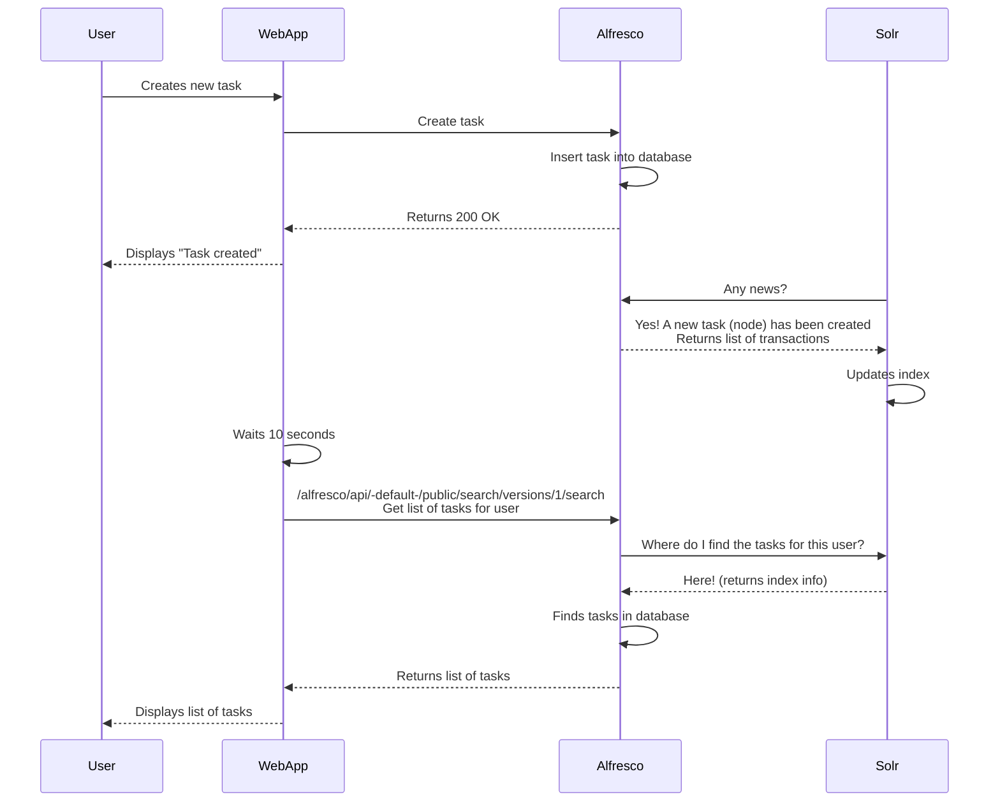
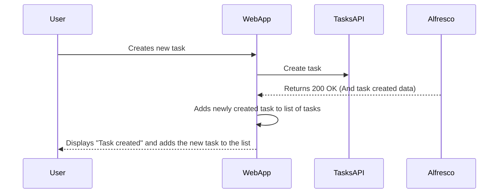

*The idea with this file is to illustrate the inherent problem of the Solr+Alfresco architecture compared to a "normal" REST API architecture*

## AS-IS: User navigates to "My tasks" to see a list of tasks
### Tasks are returned from a solr search (fast)

## TO-BE: User navigates to "My tasks" to see a list of tasks
### Tasks are returned from a query performed by the TasksAPI (fast)

## AS-IS: User adds a task to the "My tasks" list (eventual consistency with SOLR)

## TO-BE: User adds a task to the "My tasks" list (strong consistency with REST API)

