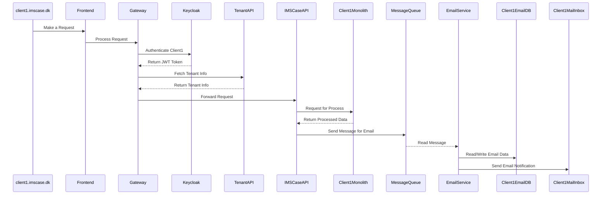

```mermaid
sequenceDiagram
    participant Client1 as client1.imscase.dk
    participant Frontend
    participant Gateway
    participant Keycloak
    participant TenantAPI
    participant IMSCaseAPI
    participant Client1Monolith
    participant MessageQueue
    participant EmailService
    participant Client1EmailDB
    participant Client1MailInbox

    Client1->>Frontend: Make a Request
    Frontend->>Gateway: Process Request
    Gateway->>Keycloak: Authenticate Client1
    Keycloak-->>Gateway: Return JWT Token
    Gateway->>TenantAPI: Fetch Tenant Info
    TenantAPI-->>Gateway: Return Tenant Info
    Gateway->>IMSCaseAPI: Forward Request
    IMSCaseAPI->>Client1Monolith: Request for Process
    Client1Monolith-->>IMSCaseAPI: Return Processed Data
    IMSCaseAPI->>MessageQueue: Send Message for Email
    MessageQueue-->>EmailService: Read Message
    EmailService->>Client1EmailDB: Read/Write Email Data
    EmailService->>Client1MailInbox: Send Email Notification
```