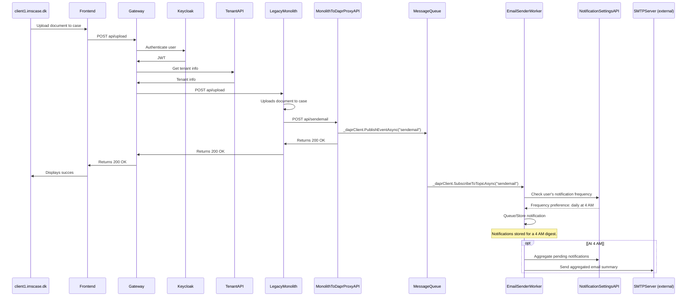

```mermaid
sequenceDiagram
    participant Client1 as client1.imscase.dk
    participant Frontend
    participant Gateway
    participant Keycloak
    participant TenantAPI
    participant LegacyMonolith
    participant MonolithToDaprProxyAPI
    participant MessageQueue
    participant EmailSenderWorker
    participant NotificationSettingsAPI
    participant SMTPServer as SMTPServer (external)

    Client1->>Frontend: Upload document to case
    Frontend->>Gateway: POST api/upload
    Gateway->>Keycloak: Authenticate user
    Keycloak->>Gateway: JWT
    Gateway->>TenantAPI: Get tenant info
    TenantAPI->>Gateway: Tenant info
    Gateway->>LegacyMonolith: POST api/upload
    LegacyMonolith->>LegacyMonolith: Uploads document to case
    LegacyMonolith->>MonolithToDaprProxyAPI: POST api/sendemail
    MonolithToDaprProxyAPI->>MessageQueue: _daprClient.PublishEventAsync("sendemail")
    MonolithToDaprProxyAPI->>LegacyMonolith: Returns 200 OK
    LegacyMonolith->>Gateway: Returns 200 OK
    Gateway->>Frontend: Returns 200 OK
    Frontend->>Client1: Displays succes
    MessageQueue->>EmailSenderWorker: _daprClient.SubscribeToTopicAsync("sendemail")
    EmailSenderWorker->>NotificationSettingsAPI: Check user's notification frequency
    NotificationSettingsAPI-->>EmailSenderWorker: Frequency preference: daily at 4 AM
    EmailSenderWorker->>EmailSenderWorker: Queue/Store notification
    
    Note over EmailSenderWorker: Notifications stored for a 4 AM digest.
    opt [At 4 AM]
        EmailSenderWorker->>NotificationSettingsAPI: Aggregate pending notifications
        EmailSenderWorker->>SMTPServer: Send aggregated email summary
    end
```